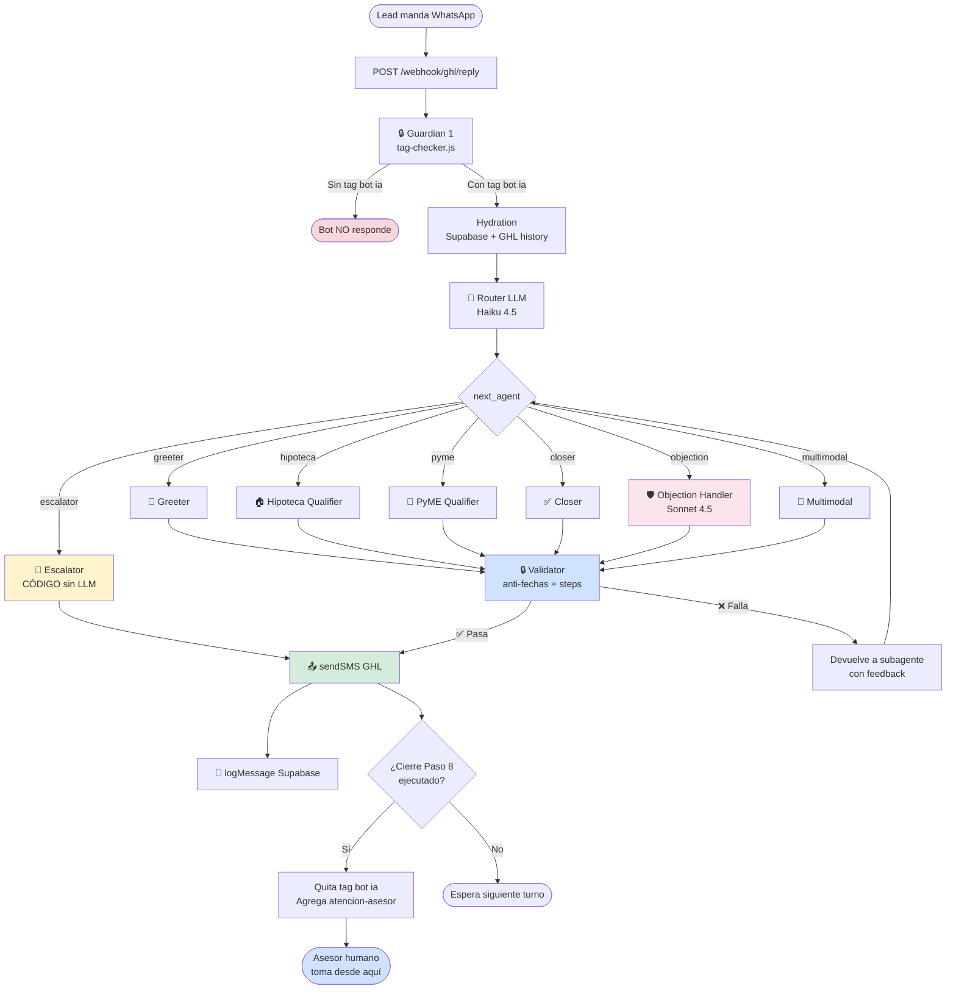

# 99 · ARQUITECTURA GENERAL — ALEJANDRA SUBAGENTES

> **Lectura obligatoria antes de tocar código.** Este documento es el "mapa mental" del nuevo sistema.

---

## CONTEXTO

Alejandra es un bot de WhatsApp para **Crediexpres México** (broker hipotecario y PyME). Recibe leads, los pre-califica con un flujo de 8 pasos, y los pasa a un asesor humano (Efraín hipotecario / Saúl PyME / Luis casos especiales).

**Versión anterior (monolítica) tenía 3 problemas críticos:**
1. Modelo se confundía con el prompt de ~200K chars
2. Inventaba fechas calendario que el lead nunca dijo
3. Saltaba pasos del flujo

**Versión nueva (subagentes) resuelve esto** distribuyendo la lógica en agentes especializados con prompts cortos + guardrails determinísticos en código.

---

## STACK TÉCNICO

- **Runtime:** Node.js (ESM)
- **Framework:** Express (webhooks GHL)
- **LLM:** OpenRouter (Claude Haiku 4.5 default, Sonnet 4.5 para objeciones)
- **Vector store:** Pinecone (chunking por header H3)
- **Memoria:** Supabase (tabla `leads` con `eventos` JSONB)
- **CRM:** GoHighLevel (GHL) — webhooks de entrada/salida
- **Cron:** `node-cron` para follow-ups

---

## DIAGRAMA MAESTRO



---

## EL FLUJO DE 8 PASOS (canónico)

| Paso | HIPOTECA | PYME | Subagente |
|---|---|---|---|
| 1 | Saludo + nombre | Saludo + nombre | Greeter |
| 2 | Tipo crédito | Tipo crédito | Greeter |
| 3 | Necesidad (comprar/construir/refi/liquidez) | PF con actividad o PM | Hipoteca / PyME |
| 4 | Monto aproximado | Uso del crédito | Hipoteca / PyME |
| 5 | Asalariado/independiente + cómo comprueba ingresos (FUSIONADA) | Monto aproximado | Hipoteca / PyME |
| 6 | Buró | Identificación ruta (TPV/propiedad/SAT) | Hipoteca / PyME |
| 7 | Explicación breve del producto | Buró sano (empresa+RL+accionistas) | Hipoteca / PyME |
| 8 | CIERRE — frase canónica + handoff | CIERRE — frase canónica + handoff | Closer |

---

## GUARDRAILS DETERMINÍSTICOS (en código, NO en prompts)

### 1. `tag-checker.js`

```js
// src/guardrails/tag-checker.js
export async function isAllowedToRespond(contactId) {
  const tags = await ghl.getContactTags(contactId);
  return tags.includes('bot ia');
}
```

Se llama ANTES de invocar al Router.

### 2. `anti-fechas.js`

```js
// src/guardrails/anti-fechas.js
const FORBIDDEN_PATTERNS = [
  /\b(lunes|martes|miércoles|jueves|viernes|sábado|domingo)\b/i,
  /\b(enero|febrero|marzo|abril|mayo|junio|julio|agosto|septiembre|octubre|noviembre|diciembre)\b/i,
  /\b\d{1,2}\s+de\s+(enero|febrero|marzo|abril|mayo|junio|julio|agosto|septiembre|octubre|noviembre|diciembre)\b/i,
];

export function containsForbiddenDate(text, leadHistoryText) {
  for (const pattern of FORBIDDEN_PATTERNS) {
    if (pattern.test(text) && !pattern.test(leadHistoryText)) {
      return { blocked: true, pattern: pattern.toString() };
    }
  }
  return { blocked: false };
}
```

Excepción: si el LEAD dijo "lunes" o "mayo" en su historial, el bot puede repetirlo (raro pero posible).

### 3. `steps-validator.js`

```js
// src/guardrails/steps-validator.js
export function canExecuteCloser(profile) {
  const required = ['nombre', 'tipo_credito', 'necesidad', 'monto_solicitado_mxn', 'subtipo_o_tpv', 'historial_buro'];
  const missing = required.filter(field => !profile[field]);
  return { allowed: missing.length === 0, missing };
}
```

Si el subagente Closer es invocado pero faltan campos del profile → se rechaza la respuesta y se redirige al Qualifier.

### 4. `action-json-validator.js`

Valida que el JSON del subagente tenga el schema correcto. Si falta un campo o el `next_agent` no es válido, se rechaza.

---

## CONTRATO DE INPUT/OUTPUT (todos los subagentes)

### INPUT que recibe cada subagente

```json
{
  "lead": {
    "id": "abc123",
    "nombre": "Carlos Pérez",
    "telefono": "+5215512345678",
    "tags_actuales": ["bot ia", "lead-frio"]
  },
  "profile": {
    "tipo_credito": "hipotecario",
    "necesidad": "comprar casa",
    "monto_solicitado_mxn": null,
    "subtipo": null,
    "historial_buro": null
  },
  "history": [
    {"role": "lead", "content": "Hola"},
    {"role": "alejandra", "content": "Gracias por escribirnos..."}
  ],
  "ultimo_mensaje_lead": "como 2 millones",
  "rag_chunks": [
    "...chunks relevantes de Pinecone...",
    "..."
  ]
}
```

### OUTPUT que debe devolver cada subagente

```
[texto del SMS para el lead]

[ACTION]{"next_agent":"hipoteca|pyme|closer|...","profile_updates":{...},"needs_escalation":false,"reasoning":"..."}[/ACTION]
```

---

## TABLA RESUMEN DE SUBAGENTES

| # | Subagente | Modelo | Archivo prompt | Cuándo se invoca |
|---|---|---|---|---|
| 0 | Router | Haiku 4.5 | `00_router.md` | Cada turno antes de cualquier otro |
| 1 | Greeter | Haiku 4.5 | `01_greeter.md` | Lead nuevo o sin nombre/tipo |
| 2 | Hipoteca Qualifier | Haiku 4.5 | `02_hipoteca-qualifier.md` | Tipo=hipoteca + faltan datos pasos 3-7 |
| 3 | PyME Qualifier | Haiku 4.5 | `03_pyme-qualifier.md` | Tipo=pyme + faltan datos pasos 3-7 |
| 4 | Closer | Haiku 4.5 | `04_closer.md` | Profile completo + listo para handoff |
| 5 | Objection Handler | **Sonnet 4.5** | `05_objection-handler.md` | Lead objeta (precio, confianza, papeles, etc.) |
| 6 | Multimodal | Haiku 4.5 (vision) | `06_multimodal.md` | Lead manda imagen, audio o PDF |
| 7 | Escalator | **CÓDIGO** (sin LLM) | `08_escalator-code.md` | Lead pide humano explícito o caso complejo |
| 8 | Followup Personalizer | Haiku 4.5 | `07_followup-personalizer.md` | Cron de nudges (NO en respuesta entrante) |

---

## ESTRUCTURA DE CARPETAS PROPUESTA

```
agentes/alejandra/
├── src/
│   ├── index.js                    Express + webhooks (existente, adaptar)
│   ├── orchestrator.js             [NUEVO] Coordina Router → Subagentes → Validator
│   ├── agents/                     [NUEVO]
│   │   ├── router.js
│   │   ├── greeter.js
│   │   ├── hipoteca-qualifier.js
│   │   ├── pyme-qualifier.js
│   │   ├── closer.js
│   │   ├── objection-handler.js
│   │   ├── multimodal.js
│   │   ├── escalator.js            (código simple, sin LLM)
│   │   └── followup-personalizer.js
│   ├── guardrails/                 [NUEVO]
│   │   ├── tag-checker.js
│   │   ├── anti-fechas.js
│   │   ├── steps-validator.js
│   │   └── action-json-validator.js
│   ├── prompts/                    [NUEVO]
│   │   ├── 00_router.md
│   │   ├── 01_greeter.md
│   │   ├── 02_hipoteca-qualifier.md
│   │   ├── 03_pyme-qualifier.md
│   │   ├── 04_closer.md
│   │   ├── 05_objection-handler.md
│   │   ├── 06_multimodal.md
│   │   └── 07_followup-personalizer.md
│   ├── pinecone.js                 [NUEVO o adaptar] retrieval por namespace
│   ├── ghl.js                      (existente, mantener)
│   ├── db.js                       (existente, mantener)
│   ├── followup.js                 (existente, adaptar — usa plantillas + personalizer)
│   ├── hydration.js                (existente, mantener)
│   ├── media.js                    (existente, mantener)
│   ├── notifications.js            (existente, mantener)
│   ├── holidays.js                 (existente, mantener)
│   ├── calendar.js                 (existente, mantener)
│   ├── openrouter.js               (existente, adaptar para multi-modelo)
│   └── env.js                      (existente, mantener)
├── plantillas/                     [NUEVO]
│   ├── followup-cold-A2.txt
│   ├── followup-cold-A3.txt
│   ├── followup-cold-A4.txt
│   ├── followup-cold-A5.txt
│   ├── followup-hot-B1.txt
│   ├── followup-hot-B2.txt
│   └── followup-hot-B3.txt
└── package.json                    (existente)
```

---

## CONSIDERACIONES DE COSTO

| Componente | Tokens prompt | Tokens output | $/conversación (8 turnos) |
|---|---|---|---|
| Router (Haiku × 8 turnos) | ~500 × 8 = 4K | ~50 × 8 = 400 | ~$0.005 |
| Subagente activo (Haiku × 8) | ~700 × 8 = 5.6K | ~150 × 8 = 1.2K | ~$0.015 |
| Objection (Sonnet, eventual) | ~600 | ~200 | ~$0.005 |
| **Total estimado** | | | **~$0.025-0.04 por conversación** |

Comparado con monolítico actual (~200K chars en cada turno): **80-90% menos costo**.

---

## CRITERIO DE ÉXITO

Después de la migración, el bot debe:

1. ✅ NUNCA inventar día semana, mes, fecha calendario.
2. ✅ NUNCA llegar al cierre sin completar pasos 3-7.
3. ✅ NUNCA responder si el contacto no tiene tag `bot ia`.
4. ✅ Pasar el test de "Info, vi video y me interesa asesoría" → debe iniciar saludo, no asumir tipo de crédito.
5. ✅ Pasar el test de "quiero comprar propiedad" → debe pivotar a flujo hipoteca y empezar desde Paso 3.

---

*Arquitectura general v1.0 · Crediexpres México · 30 abril 2026*
