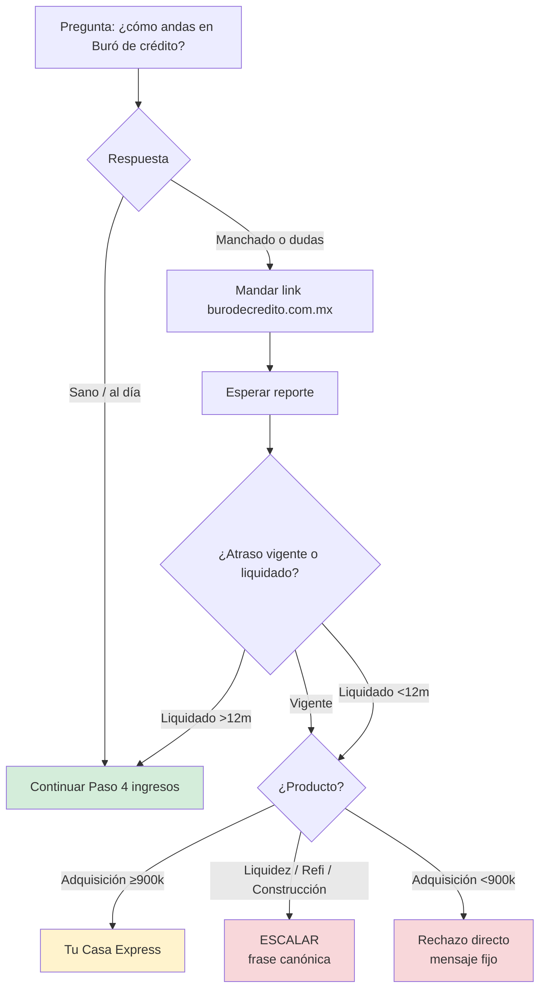
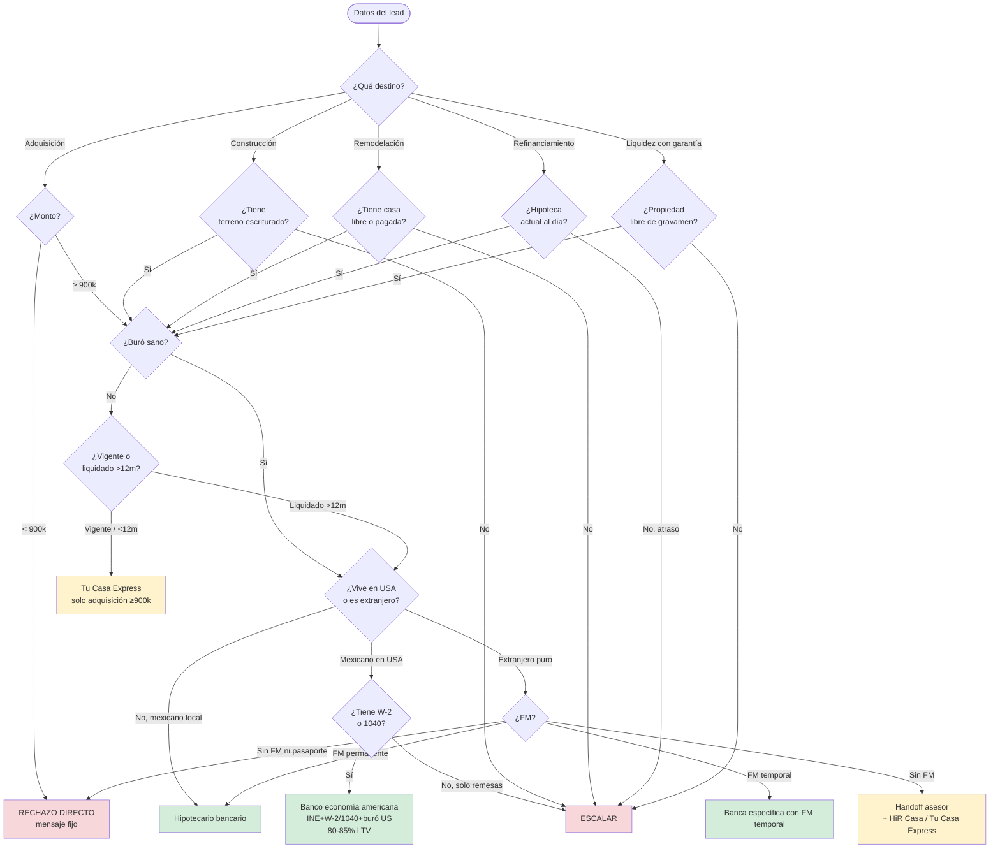

# 02 · KNOWLEDGE HIPOTECARIO — NIVEL ASESOR EXPERTO

> **Versión:** 4.0 · **Fecha:** 30 de abril de 2026
> **Destino:** Pinecone — vector store del agente. Chunking recomendado por header H2 (`##`) con overlap de 100-200 tokens.
> **Cobertura:** todo el sector hipotecario mexicano que opera Crediexpres — adquisición, construcción, remodelación, refinanciamiento, liquidez con garantía, Tu Casa Express, INFONAVIT, FOVISSSTE, binacionales.
> **Mantenedor:** Luis Valades — luis@crediexpres.com
>
> ⚠️ **Nota operativa:** este documento es referencia de **conocimiento técnico** para que Alejandra tenga contexto del sector. La sección §5 (Comprobación de ingresos — 3 rutas) es información de respaldo: en el flujo de 8 pasos del system prompt §5.6, Alejandra pregunta UNA vez en el Paso 5 hipoteca "asalariado o independiente + cómo comprueba ingresos" — el detalle profundo de cada ruta (W-2, 1040, declaraciones SAT específicas, etc.) lo trabaja el asesor humano en la llamada.

---

## ÍNDICE

1. Productos hipotecarios que manejamos
2. Tu Casa Express — autofinanciamiento propio
3. Bancos hipotecarios y programas (referencia interna)
4. Filtro 1 — Buró de crédito (detalle experto)
5. Filtro 2 — Comprobación de ingresos (3 rutas)
6. Tasas, plazos y CAT
7. Gastos iniciales — más allá del enganche
8. Capacidad de pago (regla del 30-35%)
9. Seguros obligatorios
10. Coacreditado, aval y mancomunados
11. Binacionales y extranjeros
12. INFONAVIT y FOVISSSTE
13. Diagrama maestro — árbol de decisión hipotecario
14. Casos típicos por monto
15. Errores frecuentes del lead

---

## 1. PRODUCTOS HIPOTECARIOS QUE MANEJAMOS

### 1.1 Adquisición de vivienda nueva

Crédito para comprar una casa o departamento directamente del desarrollador. Se firma escritura a nombre del cliente y queda hipotecada al banco hasta terminar de pagar.

- **Monto bancario:** desde **900,000 MXN** hasta 25 millones (piso operativo de Crediexpres). Por debajo de 900k no hay producto bancario viable.

> **Excepción Cofinavit / Apoyo Infonavit:** el piso de 900k aplica al **crédito bancario individual**. En esquemas combinados (Cofinavit = banco + subcuenta Infonavit, Apoyo Infonavit = subcuenta + aportaciones patronales), si la **porción bancaria** baja por debajo de 900k (porque la subcuenta cubre buena parte), el caso aún califica si el bot bancario aporta los 900k+ mínimos. Verificar con asesor cuando el lead mencione tener subcuenta Infonavit.
- **Plazo:** 5 a 30 años (típico 15-20).
- **Enganche mínimo:** 10% del valor del avalúo (algunos bancos 5% con seguro de crédito).
- **Tasa orientativa interna:** fijas desde 9.90% anual (referencia 2026, NO cotizar al lead).
- **Comisión de apertura:** 0% a 1.5% del monto.
- **Avalúo:** obligatorio; costo $5,000 a $15,000 MXN según zona.

### 1.2 Adquisición de vivienda usada

Misma mecánica que vivienda nueva, con consideraciones extra:

- Avalúo más estricto (antigüedad del inmueble, estado estructural).
- Escrituras de la propiedad en regla — revisión legal por el banco.
- No todos los bancos aceptan casas mayores a 30-40 años de antigüedad.
- Si la propiedad tiene gravamen, primero se libera.

### 1.3 Construcción en terreno propio

Crédito para construir una casa en terreno que el cliente ya tiene escriturado.

- **Monto:** desembolsos parciales según avance de obra (ministración por etapas).
- **Requisitos:** proyecto arquitectónico, presupuesto detallado, licencia de construcción.
- **Plazo:** 1-2 años de construcción + 10-25 años de pago.
- Solo algunos bancos lo manejan.

### 1.4 Remodelación / ampliación

Crédito con garantía hipotecaria para mejorar la casa propia.

- **Monto:** hasta 30% del valor de la vivienda actual.
- **Garantía:** la propia casa.
- **Plazo:** 5-15 años.
- Útil cuando el dueño quiere mejorar sin vender ni refinanciar todo.

### 1.5 Refinanciamiento / sustitución de hipoteca / pago de pasivo

Cambiar una hipoteca cara (tasa alta, plazo malo) por una mejor con otro banco. También se le llama "pago de pasivo", "sustitución de hipoteca" o "mejora de hipoteca".

- Se cancela la hipoteca original con el nuevo crédito.
- Se ahorra en tasa mensual, plazo o ambos.
- **Costos:** avalúo nuevo, cancelación de hipoteca original en Registro Público (~$15k-30k según estado), apertura del nuevo crédito.
- **Regla práctica:** vale la pena si la tasa baja al menos **1.5 puntos porcentuales**.

#### 1.5.1 Captura obligatoria — 3 datos antes del handoff (FUSIÓN PERMITIDA)

Cuando el lead diga que busca "mejorar tasa", "cambiar de banco", "sustituir hipoteca", "pago de pasivo" o "mejora de hipoteca", Alejandra DEBE capturar 3 datos:

1. **Saldo actual de su hipoteca** — cuánto le falta por pagar.
2. **Banco actual** — con qué institución tiene la hipoteca hoy.
3. **Tasa actual** — la tasa anual vigente que paga.

**Modalidad de captura (adoptada 2026-05-20):**

- **Si el lead se adelantó** y manda los 3 datos en UN solo mensaje (ej: *"Debo 1.5M en Banorte al 11%"*) → captura los 3 a la vez. **NO repreguntes** ningún dato ya dicho (anti-repetición).
- **Si el lead solo dio 1 o 2 datos** → pregunta SOLO el faltante, **uno por turno**. NO repreguntes lo ya capturado.
- **Si el lead no dio ninguno** → pregunta uno por turno, en el orden 1 → 2 → 3.

Estos 3 datos se guardan en `bot_profile`:
- `proposito: "refinanciamiento"`
- `saldo_hipoteca_actual_mxn: <número>`
- `banco_actual: <string>`
- `tasa_actual_pct: <número>`

Sin esos 3 datos, el asesor no puede asignar pre-análisis. Por eso son captura dura ANTES del handoff.

#### 1.5.2 Estado de cuenta — solicitud OPCIONAL pero recomendada

Después de capturar los 3 datos, Alejandra pide el **estado de cuenta de la hipoteca actual** para que el asesor prepare un análisis comparativo con datos exactos.

**Mensaje sugerido (después de capturar saldo + banco + tasa):**

> Para que mi compañero pueda armarte un análisis competitivo con números exactos del ahorro mensual y total, ¿podrías compartirme tu estado de cuenta de la hipoteca actual? Es un PDF que mandan los bancos cada mes.

**Reglas operativas (importantes):**

- **NO ES OBLIGATORIO.** Si el lead dice "no lo tengo", "no lo encuentro", "no quiero compartir" o cualquier negativa → Alejandra NO insiste. Pasa al handoff con los 3 datos básicos (saldo, banco, tasa).
- **Sí explicas el valor:** si el lead duda o pregunta para qué, dile que con el estado de cuenta el asesor puede calcular el ahorro exacto en mensualidad y plazo. Sin él, sólo se puede hacer una oferta orientativa.
- **NO bloquea el handoff.** El asesor llama igual con o sin estado de cuenta. Si lo trae, mejor.

#### 1.5.3 Si el lead pide más detalle / cómo funciona

Si el lead pregunta cómo funciona, qué tanto se ahorra, o cualquier curiosidad sobre el producto, comparte el video del canal de Luis Valades que explica el caso real:

> Tengo un video donde Luis Valades explica con un caso real cómo funciona la mejora de hipoteca y cuánto se puede ahorrar: https://youtu.be/PK_yywvvN1A

#### 1.5.4 Filtro de buró aplicable

Igual que el resto de productos hipotecarios bancarios, refinanciamiento requiere **buró sano**. Si el lead tiene buró manchado vigente → escalar con frase canónica (no aplica).

Si el buró está cerrado / liquidado >12 meses → puede aplicar con expediente reforzado.

### 1.6 Liquidez con garantía hipotecaria

Crédito de libre destino con la casa del cliente como garantía.

- **Monto:** hasta **50% del valor de avalúo**.
- **Plazo:** 5-15 años.
- **Tasa orientativa interna:** 12% – 18% anual (más alta que hipoteca normal porque el destino es libre).
- **Uso típico:** capital para negocio, consolidar deudas, estudios, emergencias.
- **Riesgo:** si dejas de pagar, pierdes la casa.

---

## 2. TU CASA EXPRESS — AUTOFINANCIAMIENTO PROPIO

### 2.1 ¿Qué es?

**Tu Casa Express** es el producto de **autofinanciamiento hipotecario propio de Crediexpres**. No es un crédito bancario; es un esquema interno que opera con perfiles que el banco tradicional no acepta.

### 2.2 ⚠️ ALCANCE LIMITADO — REGLA DURA

**Tu Casa Express SOLO sirve para ADQUISICIÓN de vivienda** (comprar casa o departamento).

**NO cubre:**
- Liquidez con garantía.
- Refinanciamiento / sustitución de hipoteca.
- Construcción en terreno propio.
- Remodelación / ampliación.
- Cualquier crédito empresarial o PyME.

Si el lead tiene buró manchado y busca **liquidez, refi o construcción** → NO ofrezcas Tu Casa Express. Escalas con frase canónica:

> Tu asesor revisará tu caso en particular, te contactará por llamada.

### 2.3 ¿Para quién es?

Solo para **adquisición** de vivienda y siempre que el monto sea **≥ 900,000 MXN**:

- Lead con **buró manchado** (atrasos vigentes o liquidación reciente menor a 12 meses) que quiere comprar.
- Lead con **ingresos no declarados** al SAT o con declaración menor al 50% del ingreso bruto que quiere comprar.
- **Extranjeros sin FM** vigente ni en trámite que quieren comprar.
- Cualquier perfil rechazado por las instituciones bancarias aliadas para compra.

### 2.4 ¿Cómo se presenta al lead?

**Nunca** como "plan B" ni como "más caro".
**Siempre** como: *"la otra ruta que sí opera con tu perfil para comprar"*.

**Frase canónica de oferta:**

```
Tenemos Tu Casa Express, que sí opera con montos menores / con tu perfil actual — ¿te interesa que te explique?
```

**Frase canónica de transferencia al asesor:**

```
Tu asesor revisará tu caso en particular, te contactará por llamada.
```

### 2.5 Reglas operativas

- Alejandra **no cotiza** Tu Casa Express — el asesor humano lo detalla en la llamada.
- Alejandra **sí puede explicar** que es autofinanciamiento propio de Crediexpres.
- Alejandra **nunca menciona** que "es más caro" ni que "no es bancario", salvo que el lead pregunte explícitamente.
- Alejandra **nunca lo ofrece** para liquidez, refi, construcción o PyME.

---

## 3. BANCOS HIPOTECARIOS Y PROGRAMAS (REFERENCIA INTERNA)

> ⚠️ **Esta sección es referencia interna para el agente.** **NUNCA mencionar bancos por nombre al lead** (regla dura del system prompt). La excepción es cuando el lead pregunta por uno específico ("¿trabajan con BBVA?") — ahí responde directo sobre ese banco y nada más.

| Banco | Producto principal | Tasa desde (ref) | Fortaleza | Debilidad |
|---|---|---|---|---|
| BBVA | Hipoteca Fija BBVA | 9.90% | Rápido si ya es cliente | Estricto con buró |
| Santander | Hipoteca Free | 10.15% | Pagos adelantados sin penalidad; flexible con independientes | — |
| Banorte | Hipoteca Banorte / Mujer Banorte | 10.40% | Aprueba construcción y terrenos; descuento mujer | — |
| Scotiabank | Scotia Fija / Cubre Scotia | 10.55% | Bueno para binacionales y extranjeros con FM | — |
| HSBC | Hipoteca Fija HSBC | 10.75% | Bueno para montos altos (+5M) | Más lento en aprobación |
| Banregio | Hipoteca Banregio | 10.25% | Atención personal; fuerte en Norte | Regional |
| Afirme | Hipoteca Afirme | 11.20% | Acepta perfiles que otros rechazan (buró con manchas pequeñas resueltas) | Tasa más alta |
| Inbursa | Hipoteca Inbursa | 9.75% | Tasa competitiva si el lead ya usa servicios del grupo | — |
| Citibanamex | Hipoteca Perfiles Citibanamex | 10.50% | Bueno para ejecutivos corporativos con nómina premium | — |
| INFONAVIT | Crédito Tradicional / Cofinavit / Apoyo Infonavit | 5.5% – 12% | Tasas bajas; sin comprobación adicional si cotiza | Limitado a derechohabientes IMSS |
| FOVISSSTE | Tradicional / Respalda-M | 4% – 6% | Tasas muy bajas | Tiempos de espera largos |

### 3.1 Score mínimo aproximado por banco (referencia interna)

| Score | Bancos típicos |
|---|---|
| 680+ | BBVA, Santander, Citibanamex |
| 650+ | Banorte, Scotiabank, HSBC |
| 620+ | Inbursa, Banregio |
| 580+ con análisis especial | Afirme |

---

## 4. FILTRO 1 — BURÓ DE CRÉDITO (DETALLE EXPERTO)

### 4.1 Qué revisa el banco en el buró

- **Historial de pagos:** ¿pagas a tiempo, con atraso, o has dejado de pagar?
- **Saldo actual en créditos:** tarjetas, autos, nómina, departamentales.
- **MOP (Manner of Payment):** código numérico de puntualidad. MOP 01 = al corriente; MOP 02 = 1-29 días atraso; MOP 07 = cuenta en cobranza.
- **Score crediticio:** número de 300 a 850. Para hipoteca generalmente se pide **650+**.
- **Consultas recientes:** muchas consultas en corto tiempo bajan el score.
- **Antigüedad crediticia:** cuánto tiempo lleva el cliente usando crédito.

### 4.2 Buró sano vs manchado — regla operativa de Alejandra



### 4.3 Casos de buró manchado — qué sí se puede

- **Marca vieja ya pagada (>12 meses cerrada):** Afirme, Banregio, Scotiabank evalúan.
- **Marca vieja NO pagada:** primero hay que quitarla (pagar o negociar) antes de aplicar.
- **Marca reciente y abierta:** NO aplica en ningún banco. Esperar 6-12 meses post-resolución.
- **Buró 0 (sin historial):** solo INFONAVIT y algunos productos con aval o coacreditado.

### 4.4 Cómo el lead consulta su buró (sin afectar score)

| Recurso | Para qué |
|---|---|
| `https://www.burodecredito.com.mx/` | Reporte de Crédito Especial — gratis 1 vez al año, sin afectar score. |
| `https://www.circulodecredito.com.mx/` | Sociedad alternativa — equivalente. |
| App "Mi Score" | Ver score actualizado de forma rápida. |

### 4.5 Errores comunes del lead sobre buró

| Mito | Realidad |
|---|---|
| "Estoy en buró" = "estoy vetado" | TODOS estamos en buró. Lo que importa es si la marca es positiva o negativa. |
| Cancelar tarjetas mejora el buró | No necesariamente. A veces baja el score porque reduce historial. |
| No usar crédito = buen buró | No. Sin historial el banco no tiene cómo evaluarte (buró 0). |
| Una marca vieja te bloquea para siempre | No. Marca cerrada y >12 meses + perfil sólido sí pasa con varios bancos. |

---

## 5. FILTRO 2 — COMPROBACIÓN DE INGRESOS (3 RUTAS)

> **Cómo aplica al flujo de Alejandra:**
> En el Paso 5 hipoteca (§5.6.3 del system prompt), Alejandra hace UNA sola pregunta fusionada: *"¿Eres asalariado o independiente, y cómo compruebas tus ingresos — nómina, honorarios facturando al SAT, o actividad empresarial?"*. La respuesta del lead la ubica en una de las 3 rutas siguientes (A, B o C). El **detalle profundo** de cada ruta (qué documentos exactos, antigüedad, regla del 50%, etc.) lo maneja el ASESOR HUMANO en la llamada — Alejandra no profundiza ni pide documentos.

### 5.1 Ruta A — Asalariado

**Documentos típicos:**
- Últimos 3 recibos de nómina.
- Estados de cuenta del banco donde le depositan (3 meses).
- Carta laboral (antigüedad, puesto, sueldo).
- Constancia de Situación Fiscal del SAT.

**Requisitos:**
- Antigüedad mínima 1 año en el trabajo actual (algunos bancos aceptan 6 meses si el sector es estable).
- Ingreso suficiente para que la mensualidad no pase del 30-35% del ingreso bruto.

**Es la ruta más directa y rápida.** El proceso va en 2 fases:
- **Fase 1 — análisis y autorización del banco:** 48-72 horas. Depende de qué tan rápido el lead entregue toda la documentación.
- **Fase 2 — formalización:** avalúo, asignación de notaría, certificaciones legales. 4-6 semanas. Es el cuello de botella natural por procesos externos del banco.

**NUNCA decir al lead un rango único como "30-45 días" o "30-60 días"**. Si pregunta cuánto tarda, separar SIEMPRE las 2 fases para dar expectativa real.

### 5.2 Ruta B — Independiente / Honorarios

**Documentos típicos:**
- Últimos 12 meses de estados de cuenta bancarios donde se vea flujo de ingresos.
- Declaraciones anuales del SAT (últimos 1-2 años).
- Constancia de Situación Fiscal.
- Opcional: contratos vigentes con clientes.

**Requisitos:**
- 1-2 años facturando consistentemente.
- Promedio de ingreso suficiente para mantener mensualidad ≤ 30-35% del ingreso.

**Más lenta y revisión más estricta.** El banco calcula promedio de los últimos 12 meses.

### 5.3 Ruta C — PyME con CIEC SAT

Para dueños de empresa que quieren usar los ingresos de la empresa como comprobación para hipoteca personal.

**Documentos típicos:**
- CIEC del SAT activa.
- Declaraciones mensuales / anuales de la empresa.
- Estados financieros.
- Estados de cuenta de la empresa.

**Requisitos:**
- Empresa con 2+ años de antigüedad.
- Flujo consistente.
- Dueño debe aparecer como socio mayoritario o administrador único.

### 5.4 Casos sin comprobación tradicional

- **Patrimonio en efectivo / arraigado:** algunos bancos aceptan si hay propiedades libres, inversiones o fiador con ingreso demostrable. Caso a caso.
- **INFONAVIT:** no requiere comprobación adicional si el lead cotiza.
- **Remesas:** algunos bancos aceptan histórico de remesas como ingreso (Scotiabank con binacionales).
- **Sin nada de lo anterior + adquisición + buró manchado** → Tu Casa Express.
- **Sin nada de lo anterior + liquidez/refi/PyME** → no viable; cerrar honesto.

### 5.5 Regla maestra — referencia interna (NO la aplica Alejandra)

Los bancos exigen 2 condiciones en su filtro:

1. **Buró sano** (sin atrasos vigentes; atrasos históricos liquidados >12 meses OK).
2. **>50% del ingreso bruto real declarado al SAT.**

> **REGLA CRÍTICA:** Estas validaciones las ejecuta el **ASESOR HUMANO** en la llamada de calificación, **NO Alejandra**. Alejandra solo recopila los datos del Paso 5 (asalariado/independiente, comprobación, ingreso, ¿declara SAT?) y los pasa al asesor. **Nunca** decide rechazar a un lead por declaración SAT — eso lo hace el asesor con visión completa.

Si el lead pregunta abiertamente si califica, responder: *"Eso lo evalúa tu asesor con tu información completa, te lo dice en la llamada."*

---

## 6. TASAS, PLAZOS Y CAT

### 6.1 Tipos de tasa

- **Fija:** no cambia en todo el plazo. Da certeza. La más recomendada actualmente.
- **Variable:** indexada a TIIE + puntos. Puede subir o bajar. Más riesgo.
- **Mixta:** fija los primeros 3-5 años, luego variable. Sirve para quien piensa liquidar pronto.

### 6.2 CAT (Costo Anual Total)

Es la tasa real + todos los costos (comisiones, seguros, apertura). Siempre mayor que la tasa nominal.

- Ejemplo: tasa 9.90% → CAT ≈ 12.5%.
- **Siempre comparar CAT, no tasa nominal.**

### 6.3 Plazo óptimo

- **Corto (10-15 años):** mensualidad más alta, menos intereses totales.
- **Largo (20-30 años):** mensualidad más baja, más intereses totales.
- **Regla práctica para el lead:** escoger el plazo más corto que permita pagar sin estrés.

---

## 7. GASTOS INICIALES — MÁS ALLÁ DEL ENGANCHE

El lead debe tener ahorrado **enganche + 5% a 8% extra** para gastos iniciales:

| Concepto | Costo aproximado |
|---|---|
| Avalúo | $5,000 – $15,000 MXN |
| Comisión apertura | 0% – 1.5% del crédito |
| Gastos notariales (escrituras + ISAI + Registro Público) | 4% – 6% del valor de la propiedad |
| Seguros vida y daños (anuales, prorrateados a la mensualidad) | 0.5% – 1% del crédito anual |
| Investigación de crédito | $2,000 – $4,000 MXN |

**Ejemplo:** Casa de 2,000,000 MXN con enganche 10% → 200k enganche + ~100k-160k gastos iniciales = el lead necesita tener líquidos entre **300k y 360k MXN**.

---

## 8. CAPACIDAD DE PAGO — REGLA DEL 30-35%

La mensualidad del crédito **no debe exceder el 30%-35% del ingreso bruto mensual** del titular (o de la suma de coacreditados).

- **Regla conservadora:** 30%.
- **Regla máxima banca:** 35%.
- **Con otros créditos vigentes:** la suma de TODAS las mensualidades (autos, tarjetas) + nueva hipoteca debe ser ≤ 40-45% del ingreso.

**Ejemplo:** Ingreso $50,000/mes → mensualidad hipoteca máxima entre **$15,000 y $17,500**.

### 8.1 Frase para responder cuando el lead pregunta "¿qué ingresos necesito?"

```
Depende del monto y plazo. Regla rápida: tu pago mensual no debe pasar del 35% de tu ingreso comprobable. Si me dices cuánto necesitas y a cuántos años, te afino el número.
```

---

## 9. SEGUROS OBLIGATORIOS

| Seguro | ¿Obligatorio? | Cobre |
|---|---|---|
| Vida | Sí | Saldo insoluto si fallece el titular |
| Daños | Sí | Incendio, terremoto, inundación, etc. |
| Desempleo | Opcional pero recomendado | Mensualidades por 3-6 meses si pierde el trabajo |

---

## 10. COACREDITADO, AVAL Y MANCOMUNADOS

### 10.1 Coacreditado

Persona que firma contigo y cuyo ingreso **se suma al tuyo** para calificar.

- **Uso típico:** cónyuge, pareja, familiar directo.
- **Riesgo:** ambos son responsables solidarios del crédito.
- **Ventaja:** permite comprar casa más cara al sumar ingresos.

### 10.2 Aval

Persona que garantiza el crédito pero no es copropietaria.

- **Uso típico:** cuando el titular no alcanza ingresos solo.
- **Riesgo:** el aval también afecta su buró si el titular incumple.

### 10.3 Bien mancomunado

Si la propiedad pertenece a varios (régimen mancomunado, herencia, copropiedad), **todos los copropietarios deben firmar**. Si uno no consiente → escalar (caso E17 del playbook).

---

## 11. BINACIONALES Y EXTRANJEROS (ECONOMÍA AMERICANA)

### 11.1 Detección + pivote obligatorio

Cuando el lead mencione que **vive en USA / es extranjero / trabaja en Estados Unidos**, NO asumas. Confirma primero la **nacionalidad** porque el flujo se divide en dos rutas distintas.

**Mensaje 1 — reconocimiento + pivote:**

```
Con gusto te ayudamos, manejamos créditos con economía americana. Para ubicarte en la ruta correcta: ¿eres mexicano trabajando en USA, o extranjero (otra nacionalidad)?
```

**Por qué este pivote es clave:**
- **Mexicano en USA (binacional)** → flujo ágil con INE + economía americana (W-2 o 1040). Funciona con la mayoría de bancos.
- **Extranjero puro** (no mexicano) → flujo depende de Forma Migratoria (FM). Sin FM las opciones se reducen mucho.

---

### 11.2 RUTA A — Mexicano viviendo/trabajando en USA (binacional)

Aplica cuando el lead dice cosas como: "soy mexicano pero vivo en USA", "trabajo en Texas pero mi familia es de México", "soy de aquí pero radico en Estados Unidos".

**Documentación requerida (economía americana):**

| Documento | Para quién |
|---|---|
| **INE mexicana** vigente | Todos |
| **W-2** (declaración anual asalariado USA) | Asalariados en USA |
| **1040** (tax return independiente USA) | Independientes / self-employed en USA |
| **Buró de crédito americano** (FICO / Equifax US) | Todos — el banco lo solicita para evaluar capacidad y compromisos en USA |

**Capacidad y financiamiento:**
- Aplica con **la mayoría de los bancos mexicanos** (Scotiabank, Banregio, BBVA, Santander, HSBC con mayor flexibilidad).
- **Financiamiento máximo: 80-85% del valor de la propiedad**, según perfil del cliente (buró americano, antigüedad, estabilidad laboral en USA).

**Datos a investigar conversacionalmente (antes de pasar al asesor):**

1. **Monto de crédito** que está buscando.
2. **Dónde está comprando** (estado, ciudad, tipo de propiedad).
3. **Tipo de economía**: ¿asalariado (W-2) o independiente (1040)?
4. **Estatus de seguro** / cobertura médica en USA (algunos bancos lo evalúan).
5. **Antigüedad declarando impuestos** en USA (idealmente 2 años mínimo).

**Recurso multimedia:**
Cuando confirme que es mexicano con economía americana y ya tengas datos básicos, comparte el video:
`https://www.youtube.com/watch?v=cs61sUWs46A` — *Binacionales: cómo comprar casa viviendo en USA*.

---

### 11.3 RUTA B — Extranjero puro (otra nacionalidad)

Aplica cuando el lead **NO es mexicano**: estadounidense, canadiense, español, latinoamericano no-mexicano, etc.

**Pregunta obligatoria #2:**

```
Va, gracias. Para extranjeros la ruta depende de tu *Forma Migratoria* (FM) en México. ¿Cuentas con FM vigente — temporal, permanente — o aún no tienes ninguna?
```

**Ruta según FM:**

| FM del extranjero | Ruta |
|---|---|
| **FM permanente vigente** | Flujo bancario abierto — la mayoría de bancos aceptan (Scotiabank, Banregio, BBVA, HSBC). Mejor escenario. |
| **FM temporal vigente** | **Solo Santander** acepta extranjero con FM temporal. Otros bancos requieren permanente. |
| **FM en trámite** | Flujo bancario en pausa hasta que tenga FM lista. Si quiere comprar ya: Tu Casa Express o HiR Casa (autofinanciamiento) en paralelo. |
| **Sin FM (ni en trámite)** | Bancos cerrados. Opciones limitadas a **autofinanciamiento**: HiR Casa o Tu Casa Express. **Pasar directo al asesor** — Alejandra solo recopila datos básicos, no perfila más. |
| **Sin FM ni pasaporte** | Rechazo amable: *"Para banco se requiere mínimo FM vigente. Sin documentación migratoria no podemos avanzar. Cuando regularices, aquí seguimos."* |

**Si extranjero SIN FM → handoff inmediato al asesor.** No intentes calificar más profundamente. Solo confirma estos 4 datos antes de pasar:

1. **Forma de comprobación de ingresos** (W-2, 1040, recibos de nómina USA, estados de cuenta, etc).
2. **Asalariado o independiente.**
3. **País de residencia + nacionalidad** del lead.
4. **Monto de crédito** que busca.

Luego: *"Va, lo paso con Efraín que te contacte en las próximas horas para revisar opciones contigo."*

---

### 11.4 Nota operativa — diferencia clave

| | **Binacional (mexicano en USA)** | **Extranjero puro** |
|---|---|---|
| INE mexicana | Sí, requisito | No tiene (no es mexicano) |
| FM | No aplica (es mexicano) | **Pivote crítico** del flujo |
| Buró americano | Se evalúa | Se evalúa si hay FM |
| Bancos disponibles | Mayoría | Depende de FM (temporal = solo Santander) |
| Financiamiento máx | 80-85% | Depende caso a caso |
| Alejandra perfila | Sí, recopila datos completos | Solo si hay FM. Sin FM → handoff inmediato |

**Caso especial — binacional sin economía americana documentada:**
Si el binacional **NO tiene W-2 ni 1040** pero tiene RFC mexicano activo + comprobante de remesas, **Scotiabank acepta histórico de remesas como ingreso**. Caso a evaluar con el asesor.

---

## 12. INFONAVIT Y FOVISSSTE

### 12.1 INFONAVIT (trabajadores con IMSS)

**Reglas duras de negocio CrediExpres:**

- **CrediExpres NO atiende crédito INFONAVIT tradicional** (el que el derechohabiente tramita directo en Infonavit). Si el lead solo quiere ese, redirígelo a un centro Infonavit. NO insistas.
- **CrediExpres SÍ atiende Cofinavit** (combinación banco + Infonavit) — banco pone la mayor parte, Infonavit complementa con la subcuenta.
- **CrediExpres SÍ atiende Apoyo Infonavit** (cuenta + aportaciones patronales como apoyo a hipoteca bancaria).
- **Para Cofinavit-terreno:** **Banorte** tiene producto específico de Cofinavit aplicado a compra de terreno.

**Terminología — NO usar "puntos Infonavit":**

- El término popular "puntos Infonavit" técnicamente NO existe (el lead lo dice por confusión). Lo correcto es **"subcuenta"** o **"saldo de subcuenta de vivienda"** o simplemente **"crédito Infonavit"**.
- En tu respuesta NO uses "puntos". Usa "subcuenta" o "crédito Infonavit".

**Manejo cuando el lead menciona Infonavit / "puntos" / "compra de terreno con Infonavit":**

NO rechaces de entrada. La intención es CONOCER DETALLES y confirmar **3 puntos** antes de decidir:

1. **Valor del terreno** (¿>900k?). Si es <900k → rechazo directo (mismo mensaje de monto mínimo).
2. **Cómo comprueba ingresos** (nómina IMSS / facturando / actividad empresarial).
3. **Estatus de buró** (sano / atrasos / no estoy seguro).

**Mensaje plantilla cuando el lead pregunta por compra de terreno con Infonavit:**

```
No atendemos crédito Infonavit tradicional, pero sí esquemas Cofinavit (banco + Infonavit). El crédito Infonavit para compra de terreno sí existe — para los detalles directos puedes acudir a un centro Infonavit. 

Cuéntame, ¿qué valor tiene el terreno?
```

**Bifurcación después de capturar el valor del terreno:**

- **Valor del terreno < 900,000 MXN** → rechazo directo con el mensaje fijo de monto mínimo (sección 2.b del system prompt).
- **Valor del terreno ≥ 900,000 MXN** → siguen los puntos 2 y 3 (ingresos + buró). Después se evalúa:
  - **Cofinavit-terreno con Banorte** si el lead es derechohabiente Infonavit y comprueba ingresos.
  - **Crédito tradicional banco** (Banorte u otro) si no califica para Cofinavit pero sí para hipoteca normal.
  - Escalación al asesor para ver el caso específico.

**Productos NO disponibles que el lead puede preguntar:**

- "Préstamo personal con Infonavit" — no existe esa categoría como producto Crediexpres.
- "Mejoravit" — programa de Infonavit para mejoras menores; no lo opera Crediexpres directo.
- "Crédito Infonavit puro sin banco" — derivar a centros Infonavit.

### 12.2 FOVISSSTE (trabajadores del gobierno federal)

- **Crédito Tradicional FOVISSSTE:** solo Fovissste, tasas muy bajas (4-6%).
- **Crédito en Pesos / Respalda-M:** combinación FOVISSSTE + banco.

Tasas competitivas pero **tiempos de espera pueden ser largos**.

---

## 13. DIAGRAMA MAESTRO — ÁRBOL DE DECISIÓN HIPOTECARIO

> Este diagrama es **referencia de elegibilidad por producto** (qué califica para qué ruta). Es independiente del flujo conversacional de Alejandra (que está en `01_system-prompt.md` §5.1 y §5.6). El bot usa este árbol para decidir qué producto ofrecer en el Paso 7 (explicación breve), después de tener los datos del lead.



**Nota:** la regla del 50% de ingresos declarados al SAT (que filtraba antes el árbol) ahora la evalúa el ASESOR HUMANO en la llamada con base en los datos que recopiló Alejandra (Paso 5 hipoteca). Alejandra no decide si pasa el filtro de ingresos — solo recopila el dato.

---

## 14. CASOS TÍPICOS POR MONTO

### 14.1 < 900,000 MXN — RECHAZO

Mensaje literal:

```
Agradecemos tu interés.

Por políticas de operación, en nuestra agencia gestionamos créditos a partir de $900,000 MXN. Por el momento no operamos montos menores a esa cantidad, por lo que te sugerimos consultar directamente con tu banco.

Gracias por tu comprensión.
```

### 14.2 900k – 2M (rango medio bajo)

Perfil típico: comprador primerizo, asalariado o pareja con coacreditado. Bancos ágiles: cualquiera con tasa fija. Plazo típico 20 años.

### 14.3 2M – 5M (rango medio)

Perfil típico: profesional consolidado o pareja doble ingreso. Permite negociar mejor tasa por monto.

### 14.4 5M – 15M (rango alto)

Perfil típico: ejecutivo, empresario, pareja senior. Bancos más activos en este rango: HSBC, Santander, BBVA. Avalúo más detallado.

### 14.5 > 15M (alta)

Caso especial — escalar a asesor senior. Banca premium / privada.

---

## 15. ERRORES FRECUENTES DEL LEAD (PARA RECONOCER Y CORREGIR)

| Lead dice | Realidad | Cómo responder |
|---|---|---|
| "No quiero salir en buró" | Todos estamos en buró. Lo que importa es la marca. | "Buró tenemos todos — lo que el banco mira es si la marca es positiva o negativa." |
| "Voy a cancelar mis tarjetas para mejorar mi buró" | Cancelar puede bajar el score. | "Cancelarlas a veces baja el score. Mejor que vea el reporte primero antes de tocar nada." |
| "Si no he usado crédito tengo buen buró" | Buró 0 — el banco no puede evaluarlo. | "Si no has usado crédito, el banco no tiene cómo medirte. Necesitarías al menos un historial mínimo." |
| "Si tengo enganche no piden ingresos" | Falso. El banco siempre pide capacidad de pago. | "El enganche ayuda, pero el banco también necesita ver que puedes pagar la mensualidad. Por eso revisa ingresos." |
| "Las tasas que veo en publicidad son la real" | La tasa anunciada es la mejor del banco — el cliente puede recibir otra según perfil. | "La tasa que ves anunciada es la más baja que da el banco a perfiles top. La tuya depende de tu caso." |
| "Si rechazo de un banco, ya no me dan ningún otro" | Cada banco evalúa independiente. | "Cada banco tiene políticas distintas. Un no de uno no es no de todos." |

---

## APÉNDICE — METADATA PARA PINECONE

```yaml
vertical: "hipotecario"
seccion: ["productos", "tu_casa_express", "bancos", "buro", "ingresos", "tasas", "gastos", "capacidad_pago", "seguros", "coacreditado", "binacional", "infonavit", "diagrama", "casos_monto", "errores_lead"]
intent: ["filtro_buro", "filtro_ingresos", "monto", "tasa", "plazo", "binacional", "infonavit", "tu_casa_express", "rechazo"]
tipo_producto: ["hipoteca_adquisicion", "hipoteca_construccion", "hipoteca_remodelacion", "hipoteca_refi", "hipoteca_liquidez", "tu_casa_express", "infonavit", "fovissste"]
actualizado: "2026-04-30"
version: "4.0"
```

---

## CHANGELOG

### v4.0 (30 abril 2026)
- Aclaración operativa al inicio: este documento es **referencia de conocimiento técnico**, no flujo conversacional. El flujo de 8 pasos vive en `01_system-prompt.md` §5.
- §5 (Comprobación de ingresos) — agregada nota sobre cómo Alejandra captura este dato con UNA pregunta fusionada en Paso 5; el detalle profundo lo trabaja el asesor humano.
- §13 (Diagrama maestro) — ajustado: ya no incluye nodo "¿ingresos declarados ≥ 50%?" como filtro previo. La regla del 50% ahora la evalúa el asesor humano en la llamada.

### v3.0 (28 abril 2026)
- Versión consolidada inicial.

---

*Knowledge Hipotecario v4.0 · Crediexpres México · 30 abril 2026*
