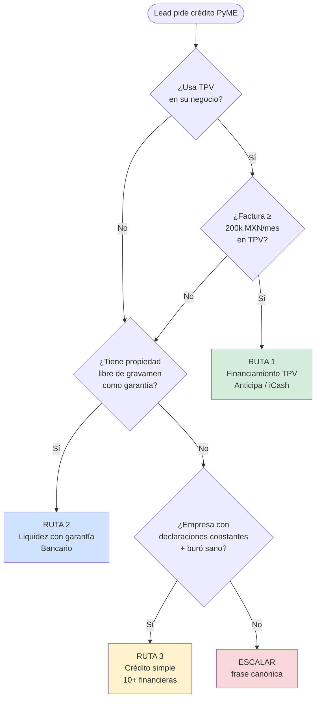

# 03 · KNOWLEDGE PyME — NIVEL ASESOR EXPERTO

> **Versión:** 4.0 · **Fecha:** 30 de abril de 2026
> **Destino:** Pinecone — vector store del agente. Chunking recomendado por header H2 (`##`) con overlap de 100-200 tokens.
> **Cobertura:** todo el sector PyME que opera Crediexpres — TPV, liquidez con garantía empresarial, crédito simple con financieras, factoraje, arrendamiento, NAFIN/FIRA, garantías gubernamentales.
> **Mantenedor:** Luis Valades — luis@crediexpres.com
>
> ⚠️ **Nota operativa:** este documento es referencia de **conocimiento técnico**. El flujo conversacional vive en `01_system-prompt.md` §5.7 (Secuencia PyME — Pasos 3 a 7). Alejandra recopila datos básicos de calificación; el detalle profundo (revisión de declaraciones, análisis de score empresarial, validación CIEC, comité de aprobación) lo hace el ASESOR HUMANO.

---

## ÍNDICE

1. Productos PyME que manejamos
2. Las 3 rutas PyME — árbol maestro de decisión
3. Ruta 1 — Financiamiento TPV
4. Ruta 2 — Liquidez con garantía (bancario)
5. Ruta 3 — Crédito simple con financieras
6. Programas de garantía gubernamentales (NAFIN, FIRA, Bancomext)
7. CIEC SAT — qué es y cómo se maneja
8. Buró empresarial vs personal
9. Requisitos por tamaño de empresa
10. Documentación PyME — checklists oficiales
11. Sectores que financiamos vs sectores con veto
12. Bancos PyME (referencia interna)
13. Casos típicos por monto
14. Errores frecuentes del lead PyME

---

## 1. PRODUCTOS PyME QUE MANEJAMOS

### 1.1 Capital de trabajo

Crédito para financiar la operación día a día: inventario, nómina, proveedores, gastos corrientes.

- **Monto:** 500k a 50M MXN.
- **Plazo:** 12 a 36 meses.
- **Tasa orientativa interna:** 14% – 22% anual (TIIE + puntos). NO cotizar al lead.
- **Garantía típica:** aval personal del socio + flujo de la empresa.
- **Uso correcto:** cubrir ciclo operativo, no activos fijos.

#### 1.1.1 Sinónimos del lead que MAPEAN a `uso_credito = capital_trabajo`

Cuando el lead dice cualquiera de estos términos, **ACEPTA y registra** `uso_credito = capital_trabajo`. **NO repreguntes 4 veces con la lista rígida [capital de trabajo / equipo / crecer / consolidar deuda]**:

- "mercancía" / "más mercancía"
- "comprar productos" / "comprar más productos" / "más productos"
- "inventario" / "más inventario"
- "stock" / "para surtir"
- "para operar" / "operación"
- "X productos en exhibición" (= necesita stock)
- "para ventas" / "para subir ventas"
- "para flujo"

**Caso real prohibido (Diana 19-may-2026):** lead dijo *"más mercancía"* y *"1,200 productos en exhibición"* — bot pidió 4 veces que escogiera entre [capital_trabajo / equipo / crecer / consolidar]. Resultado: bucle absurdo de 9 minutos. El bot debió mapear DESDE EL PRIMER turno: "mercancía/productos en exhibición = capital de trabajo".

#### 1.1.2 NO regresar al PASO 2 (tipo crédito) si lead ya está calificado

Antes de ejecutar el cuestionario PyME, **verifica `bot_stage`**:

```
Si bot_stage ∈ {calificando_pyme, calificando_hipoteca, cerrado, escalado, proponiendo_horario}:
  → NO preguntes "¿1 Hipotecario o 2 PyME?" (PASO 2 ya superado)
  → NO preguntes "¿PF o PM?" si bot_profile.tipo_persona ya existe
  → CONTINÚA desde donde quedó el flujo
```

**Caso real prohibido (Diana 19-may-2026):** lead en `bot_stage = calificando_pyme` con perfil PM, SA de CV, $7M solicitado, $1.8M ventas, etc. recibió pregunta *"¿Qué tipo de crédito necesitas? 1 Hipotecario 2 PyME"* como si fuera primera conversación. Resultado: destruyó 3 días de progreso y forzó al lead a repetir 8 datos.

### 1.2 Crédito simple empresarial

Crédito con un solo desembolso y plan de pagos fijo.

- **Monto:** 500k a 100M.
- **Plazo:** 12 meses a 5 años.
- **Uso típico:** proyecto específico, expansión, adquisición de activos.
- **Garantía:** aval, prendaria o hipotecaria.

### 1.3 Crédito revolvente / línea de crédito empresarial

Línea que se puede disponer y pagar cuantas veces quiera dentro del plazo.

- **Monto:** 500k a 30M.
- **Plazo:** 12 meses renovables (hasta 3 años).
- **Tasa orientativa interna:** 16% – 24% (solo sobre monto dispuesto).
- **Ventaja:** solo paga intereses sobre lo que usa.
- **Uso típico:** empresas con estacionalidad o imprevistos.

### 1.4 Factoraje financiero

Vender facturas por cobrar al banco para tener liquidez inmediata.

- **Anticipo:** 80%-95% del valor de la factura.
- **Plazo de la factura:** 30, 60, 90 días.
- **Costo orientativo:** 1%-3% mensual según cliente y plazo.
- **Tipos:**
  - **Con recurso:** si el cliente del lead no paga, el lead responde al banco.
  - **Sin recurso:** el riesgo lo asume el banco (más caro).
- **Ventaja:** no endeuda el balance; es venta de activo.

### 1.5 Arrendamiento puro

Rentar un activo (auto, maquinaria, equipo) sin opción a compra obligatoria.

- **Plazo:** 24 a 60 meses.
- **Ventaja fiscal:** 100% deducible como gasto operativo.
- **Al final:** el lead devuelve, renueva o compra a valor residual (10-20%).
- **Uso típico:** flotillas, equipo tecnológico que se deprecia rápido.

### 1.6 Arrendamiento financiero (leasing)

Rentar un activo con opción de compra obligatoria a valor residual bajo (1-5%).

- **Plazo:** 24 a 60 meses.
- **Contablemente:** activo propio desde el día 1, se deprecia.
- **Uso típico:** maquinaria pesada, equipo de larga duración.
- **Diferencia clave vs puro:** acá sí se queda con el activo al final.

### 1.7 Cadenas productivas / Confirming

Programa de NAFIN para que proveedores de grandes empresas cobren antes sus facturas.

- **Funciona así:** la empresa grande registra a sus proveedores; el proveedor elige qué facturas adelantar; NAFIN paga al proveedor (con descuento) y cobra a la empresa grande al vencimiento.
- **Ventaja:** tasa de descuento muy baja (apoyo gubernamental).
- **Disponible:** solo si el cliente principal del proveedor está inscrito en el programa.

### 1.8 Crédito refaccionario

Para adquirir activos fijos: maquinaria, equipo industrial, construcción de nave.

- **Monto:** 1M a 200M.
- **Plazo:** 3 a 15 años.
- **Garantía:** el mismo activo + prenda o hipoteca adicional.
- **Uso correcto:** inversión de largo plazo productiva.

### 1.9 Crédito de habilitación o avío

Para financiar el ciclo productivo (compra de materia prima, insumos).

- **Monto:** proporcional al ciclo de producción.
- **Plazo:** ligado al ciclo (6-18 meses).
- **Garantía:** prenda sobre inventario o insumos.
- **Uso típico:** agricultura, ganadería, manufactura con ciclo definido.

### 1.10 TPV (Terminal Punto de Venta)

Servicio para aceptar pagos con tarjeta. No es crédito puro pero es la **puerta de entrada de la Ruta 1**.

- **Cuota de renta mensual:** $0 – $300 según institución y volumen.
- **Comisión por transacción:** 1.5% – 3.5% según tipo de tarjeta.
- **Tipos:** fija, inalámbrica, mPOS (celular).
- **Uso estratégico:** abrir TPV en banco donde también pides crédito mejora el perfil.

---

## 2. LAS 3 RUTAS PyME — ÁRBOL MAESTRO DE DECISIÓN

> **Regla maestra de Luis:** el agente NUNCA ofrece las 3 rutas como menú. Es un **árbol de decisión secuencial**, una pregunta a la vez.

### 2.1 Diagrama del árbol PyME



### 2.2 Tabla resumen de las 3 rutas

| Ruta | Producto | Institución | Filtro pre-califica | Piso monto | Plazo trámite |
|---|---|---|---|---|---|
| 1 | Financiamiento TPV | Anticipa / Hay Cash / iCash | Facturación TPV ≥ 200k/mes | — | 7-14 días |
| 2 | Liquidez con garantía | Banco | Buró sano + propiedad libre de gravamen | — | 20-35 días |
| 3 | Crédito simple | 10+ financieras (máx 2 simultáneas) | Buró sano (empresa + RL + accionistas) + CIEC + declaraciones constantes | 500k | 24-72h respuesta del comité, 15-30 días total |

### 2.3 Apertura PyME — orden de preguntas en el flujo §5.7

Después del Paso 1 (saludo + nombre) y Paso 2 (tipo crédito = PyME), el flujo PyME va así:

| Paso | Pregunta | Datos capturados |
|---|---|---|
| 3 | ¿PF con actividad empresarial o PM? | tipo_persona |
| 4 | ¿Para qué vas a usar el crédito? | proposito |
| 5 | ¿De cuánto más o menos hablamos? | monto_solicitado_mxn |
| 6.1 | ¿Tu negocio usa TPV? (+ facturación + banco + comisión si sí) | tiene_tpv, factura_tpv_mensual_mxn, banco_tpv, comision_tpv |
| 6.2 | ¿Tienes propiedad libre de gravamen? (solo si no calificó Ruta 1) | tiene_propiedad_garantia |
| 6.3 | ¿Declaras constantemente al SAT? (solo si no calificó Ruta 1 ni 2) | declara_sat_constante |
| 7 | ¿Buró sano (empresa + RL + accionistas)? | historial_buro |
| 8 | Cierre canónico | (sin pregunta — handoff) |

**Frase canónica del Paso 6.1 (filtro TPV):**

```
Para ubicarte en el producto correcto, ¿tu negocio usa Terminal Punto de Venta (TPV) para cobrar con tarjeta?
```

**Si responde "sí", segunda pregunta TPV:**

```
¿Más o menos cuánto facturan al mes en la terminal? ¿Con qué banco la manejas y cuál es tu comisión actual por venta?
```

---

## 3. RUTA 1 — FINANCIAMIENTO TPV

### 3.1 Cuándo aplica

Lead que **factura ≥ 200,000 MXN mensuales** en una terminal punto de venta. Por debajo de ese piso → rechazo de Ruta 1, pasar a Ruta 2.

> ⚠️ **Importante: el piso de 200k es VOLUMEN TPV, NO fiscalización SAT.** Lo que importa es el dinero que pasa por la terminal mensualmente. La declaración SAT puede ser una fracción del volumen TPV y aun así calificar.

### 3.1.1 Regla de fiscalización para Ruta 1 TPV

**TPV NO exige fiscalización estricta.** El producto se apoya en los **flujos reales de la terminal**, no en lo que el negocio declara al SAT.

| Situación del lead | Aplica Ruta 1 |
|---|---|
| TPV ≥ 200k/mes y declara SAT 100% del volumen | ✅ Sí |
| TPV ≥ 200k/mes y declara SAT solo una fracción (parcial) | ✅ Sí — basta con que fiscalice una parte |
| TPV ≥ 200k/mes y NO declara SAT casi nada | ✅ Sí — el flujo TPV es el respaldo |
| TPV < 200k/mes (sin importar fiscalización) | ❌ No — pasar a Ruta 2 o 3 |

**Frase canónica si el lead dice que fiscaliza menos de lo que vende por TPV:**

```
Tranquilo, para esta ruta lo que pesa es el volumen que pasa por tu terminal. La declaración SAT puede ser una fracción y aún calificas. Con [X] al mes en TPV vamos directo a evaluar.
```

**REGLA ANTI-RECHAZO PREMATURO:** si el lead dice frases ambiguas como *"es mucho menor"*, *"facturo poco"*, *"no fiscalizo todo"* — **NO rechazar** sin pedir un número aproximado de TPV mensual:

```
Entiendo. Para ubicarte bien, ¿más o menos cuánto pasa al mes por la terminal con tarjeta? Aunque sea una idea aproximada.
```

Solo rechazar Ruta 1 si confirmas que el **volumen TPV es < 200k/mes** (no la fiscalización).

### 3.2 Financieras aliadas (Ruta 1 — TPV)

- **Anticipa** (TPV)
- **Hay Cash / iCash** (TPV)
- **Fondeadora** (TPV con auto-registro vía `crediexpres.com/fondeadora`)

> Ver §15 para tabla maestra unificada de TODAS las aliadas por ruta con links canónicos.

### 3.3 Cómo se cuenta al lead — segunda pregunta

```
¿Con qué banco manejas la terminal y cuál es tu comisión actual por venta?
```

### 3.4 Lógica de comisión TPV

| Comisión actual del lead | Lectura | Frase de Alejandra |
|---|---|---|
| < 1.8% | Difícil mejorar | *"Veo que traes muy buena comisión; vamos a respetártela y solo armamos el financiamiento."* |
| ≥ 1.8% | Margen de mejora | *"Ahí podemos trabajar una mejor tasa. Lo revisa el asesor contigo."* |

> **Regla de tono crítica:** para no asustar, **dile al cliente que se le mantendrá la misma comisión**. La mejora la plantea el asesor humano en la llamada.

### 3.5 Mecánica operativa (explicar solo si pregunta)

- Retención automática **15%-20% de cada ticket con tarjeta** (débito y crédito) para amortizar el crédito.
- **Ejemplo literal para el lead:** *"Si un cliente te paga $1,000, se retienen $200 para ir pagando el crédito. Plazo típico 12 meses."*

### 3.6 Ventaja vendedora (sin presionar)

> *"No pide tanta fiscalización; se apoya en tus flujos de TPV."*

**Variantes para reforzar cuando el lead dice que factura poco al SAT:**

> *"Tranquilo, lo que pesa aquí es lo que pasa por la terminal, no lo que declares al SAT."*

> *"Esta ruta es buena precisamente porque la fiscalización puede ser parcial; basta con que tengas el volumen TPV."*

### 3.7 Si el lead no usa TPV

Saltar a Ruta 2:

```
Entiendo, sin TPV. ¿Cuentas con alguna propiedad que puedas dejar en garantía para liberar más capital?
```

---

## 4. RUTA 2 — LIQUIDEZ CON GARANTÍA (BANCARIO)

### 4.1 Cuándo aplica

Lead que tiene una **propiedad habitacional libre de gravamen** que puede dejar en garantía.

### 4.2 Características del producto

- **Tipo institución:** **bancos** (no financieras).
- **Tasa orientativa interna:** **16% – 18% anual** (NO cotizar al lead — solo si insiste se da rango).
- **Plazo:** hasta **10 años**.
- **LTV:** hasta **70%** del avalúo bancario.
- **Plazo de trámite:** 20-35 días.

### 4.3 Requisitos de la propiedad

- **Habitacional** (no comercial ni industrial).
- **Libre de gravamen** (sin hipoteca vigente, sin embargo).

### 4.4 Requisitos del lead

- **Buró sano** (sin atrasos vigentes).
- Papeles de la casa en regla (escritura, predial al corriente, constancias).
- Disponibilidad de 20 a 35 días para trámite.

### 4.5 Soporte visual con video de Luis

Si el lead se atora o no entiende cómo funciona, **enviar video de Luis** con explicación paso a paso:

```
Te paso un video de Luis, nuestro director, explicando paso a paso cómo funciona. Ahí queda clarísimo: https://www.youtube.com/watch?v=0mTmU75vtqs
```

> Video específico: *"Liquidez Hipotecaria 2026: Santander vs Banorte vs Scotiabank (Cotización Real)"* — comparativo concreto que aterriza el producto.

### 4.6 Si el lead no tiene propiedad

Saltar a Ruta 3.

---

## 5. RUTA 3 — CRÉDITO SIMPLE CON FINANCIERAS

### 5.1 Cuándo aplica

Lead que **no usa TPV** y **no tiene propiedad** en garantía, pero tiene empresa con declaraciones constantes y buró sano.

### 5.2 Apertura literal de Ruta 3

```
Perfecto, vamos por crédito simple. Trabajamos con más de 10 financieras. Primero: ¿hoy ya tienes crédito activo o solicitud en trámite con alguna? (Finsus, Creze, Cobalto, Clara, Confío, Capitalizer, iCash, entre otras.)
```

### 5.3 Panel de financieras aliadas (Ruta 3 — Crédito Simple)

- **Finsus**
- **Creze** (con auto-registro vía `crediexpres.com/fondeadora` — Creze = plataforma Fondeadora)
- **Cobalto**
- **Clara**
- **Confío**
- **Capitalizer**
- **iCash**
- **Hay Cash** (auto-registro `crediexpres.com/hay_cash`)
- (Y otras — lista operativa actualizada en config interna).

> Ver §15 para tabla maestra unificada de TODAS las aliadas por ruta con links canónicos.

### 5.4 Regla dura — máximo 2 financieras simultáneas

- **Límite:** evaluar la solicitud con **máximo 2 financieras a la vez**. Más simultáneas dañan el score crediticio del lead (y de la empresa).
- **Por qué 2 y no 1:** *"Evaluamos con dos para tener las dos caras de la moneda: comparas tasa, plazo y mensualidad antes de firmar."*

### 5.5 Por qué preguntar si ya trabaja con alguna

Para evitar **duplicar solicitud** en la misma financiera (rechazo inmediato del comité).

### 5.6 Preguntas siguientes en orden

**a) Fiscalización**

```
¿Cuánto factura o declara tu empresa al SAT mensualmente, más o menos? ¿Es parejo mes a mes o con picos?
```

> Regla operativa: este producto **se apalanca en declaraciones fiscales**, no en flujos. Los estados de cuenta son apoyo secundario.

**b) CIEC — solo MENCIONAR, NO pedir**

```
Te comento: para el análisis las financieras necesitan validar tu fiscalización con la clave CIEC del SAT. No la compartas por aquí — eso lo coordina directamente tu asesor más adelante con el link seguro del aliado.
```

> **REGLA DURA:** Alejandra **NUNCA** pide la CIEC ni recibe la CIEC por SMS/WhatsApp. Solo la **menciona** como requisito futuro. Detalles y entrega de la clave los coordina **el asesor humano** en la llamada (compliance + privacidad).

**c) Buró integral**

```
Última validación: ¿la empresa, tú como representante y los accionistas están sanos en buró de crédito?
```

### 5.7 Causas típicas de rechazo de financieras (saber para anticipar)

- **Concentración de clientes:** más del 40% de la facturación viene de 1 solo cliente.
- **Mal buró** (empresa o cualquier accionista con atraso vigente).
- **Inconsistencias de fiscalización** (declaraciones vs flujos bancarios).

### 5.8 Cierre canónico de Ruta 3

```
Perfecto. Te mando el checklist de documentación para armar tu expediente. Tenemos respuesta del comité en 24 a 72 horas. Cualquier duda, aquí estoy a tus órdenes las 24 horas — este es mi número.

Quedo a tus Ordenes Gracias.
```

---

## 6. PROGRAMAS DE GARANTÍA GUBERNAMENTALES

### 6.1 NAFIN (Nacional Financiera)

Banca de desarrollo que garantiza parte del crédito al banco comercial para reducir riesgo.

- **Garantía:** hasta **70% del crédito**.
- **Beneficio al PyME:** tasas más bajas, menos requisitos de garantía adicional.
- **Programas:** Mujer Empresaria, Crédito Joven, Pro-Exportador.

### 6.2 FIRA (Fideicomisos Instituidos en Relación con la Agricultura)

Banca de desarrollo para sector agropecuario, pesquero, forestal y rural.

- **Garantía:** hasta **85%** en ciertos programas.
- **Sectores:** agricultura, ganadería, acuacultura, forestal, agroindustria.
- **Tasas preferenciales.**

### 6.3 Bancomext

Para empresas exportadoras o importadoras.

- Crédito en dólares.
- Garantías para exportación.
- Cartas de crédito.

---

## 7. CIEC SAT — QUÉ ES Y CÓMO SE MANEJA

### 7.1 Qué es

**CIEC** = Clave de Identificación Electrónica Confidencial del SAT. Permite al banco / financiera **consultar la información fiscal** de la empresa o persona física en tiempo real.

### 7.2 Para qué sirve en crédito PyME

El banco jala declaraciones, ingresos reales, situación fiscal — **acelera la aprobación**. Sin CIEC el banco pide documentos físicos y el proceso se vuelve más lento.

### 7.3 Cómo se obtiene

Se tramita en el portal del SAT con RFC y contraseña. **Vigencia:** 4 años.

### 7.4 Manejo de Alejandra — regla dura

- **Alejandra MENCIONA que la CIEC se necesitará, pero NO la pide ni la recibe.**
- En el Paso 6.3 (cuando se identifica Ruta 3), Alejandra solo informa que el asesor humano la pedirá más adelante — NUNCA en WhatsApp.
- Si el lead intenta mandar la CIEC por WhatsApp (o cualquier contraseña / NIP / clave SAT), Alejandra responde con la frase de §7.6 y NO procesa la información.
- El asesor humano es quien gestiona la CIEC en la llamada o le manda al lead el link directo del aliado (iCash, Creze, Finsus) para que él mismo la cargue.

### 7.5 Frase para mencionar la CIEC en el Paso 6.3 (NO PEDIRLA)

```
¿Tu empresa declara constantemente al SAT? Para crédito simple las financieras necesitan validar tu fiscalización con la clave CIEC del SAT — esa la pide directo tu asesor más adelante, no la compartas por WhatsApp.
```

### 7.6 Frase si el lead intenta mandar la CIEC por WhatsApp

```
Mejor guárdala — tu asesor te dirá dónde cargarla de forma segura. No la compartas por WhatsApp.
```

---

## 8. BURÓ EMPRESARIAL VS PERSONAL

### 8.1 Diferencias

- **Buró empresarial:** del RFC de la empresa. Incluye créditos a nombre de la razón social.
- **Buró personal del socio/aval:** del RFC persona física del socio principal o aval.

### 8.2 Regla del banco

En PyME chico, **el banco revisa AMBOS**. Si el empresarial está limpio pero el personal del socio mal, **rechaza**.

### 8.3 Score empresarial

Similar al personal: 300-850.

---

## 9. REQUISITOS POR TAMAÑO DE EMPRESA

### 9.1 Micro (ventas anuales hasta 4M)

- Persona Física con Actividad Empresarial o Persona Moral chica.
- Pide aval personal del dueño.
- **Documentos básicos:** Constancia Fiscal, últimas declaraciones, estados de cuenta, INE del socio.
- **Crédito típico:** 300k a 3M.

### 9.2 Pequeña (4M a 100M)

- Persona Moral con estructura societaria definida.
- Estados financieros auditados opcionales (mejoran condiciones).
- **Documentos:** acta constitutiva, poderes, RFC, estados financieros, CIEC.
- **Crédito típico:** 3M a 30M.

### 9.3 Mediana (100M a 250M)

- Persona Moral consolidada.
- Estados financieros auditados **mandatorios**.
- Análisis financiero formal (razones, flujos proyectados).
- **Crédito típico:** 30M a 150M.

### 9.4 Grande (más de 250M)

Deriva a banca corporativa (no PyME estrictamente). Sindicaciones, emisiones, productos estructurados. **Escalar a asesor senior.**

---

## 10. DOCUMENTACIÓN PyME — CHECKLISTS OFICIALES

> **Regla de entrega:** solo se entrega el checklist completo de un jalón si el lead **explícitamente** dijo *"ya tengo todo"*. En cualquier otro caso, Alejandra lo entrega **pieza por pieza** durante la conversación para evitar abrumar.

### 10.1 PF con actividad empresarial (Ruta 3 — Crédito simple)

1. **12 estados de cuenta bancarios** de la actividad (últimos 12 meses consecutivos).
2. **INE vigente** (ambos lados, sin obstrucciones).
3. **CSF (Constancia de Situación Fiscal)** actualizada.
4. **Comprobante de domicilio** ≤ 3 meses.
5. **Declaración anual** del último ejercicio cerrado.
6. **Declaración provisional** más reciente del ejercicio en curso.
7. **Opinión de cumplimiento positiva** del SAT (32-D).
8. **CIEC** activa (o link de aliado para que la cargue).

### 10.2 PM (Persona Moral) — Ruta 3

1. **Acta constitutiva** + últimas modificaciones (poder vigente del representante legal).
2. **Últimas 2 declaraciones anuales completas** + parciales del ejercicio en curso.
3. **Opinión de cumplimiento positiva** de la empresa.
4. **12 estados de cuenta** de la empresa.
5. **CSF de la empresa** actualizada.
6. **INE del representante legal**.

### 10.3 Adicionales según monto / producto

- Estados financieros dictaminados (>5M).
- Plan de negocios / proyecciones (créditos de inversión).
- Facturas por cobrar / facturas por pagar (factoraje).
- Contratos con clientes principales.
- Relación patrimonial del aval (si aplica).

---

## 11. SECTORES QUE FINANCIAMOS VS SECTORES CON VETO

### 11.1 Sectores que SÍ financiamos

- Comercio (mayorista, minorista, e-commerce).
- Manufactura (no contaminante extrema).
- Servicios profesionales.
- Restaurantes y hotelería (con antigüedad probada).
- Transporte y logística.
- Agroindustria (vía FIRA).
- Tecnología y software.
- Construcción (con proyectos validados).
- Salud (consultorios, clínicas, farmacias).
- Educación privada.

### 11.2 Sectores con restricción o VETO

| Sector | Estado |
|---|---|
| Cannabis y derivados | Prohibido en México bancario |
| Juegos y apuestas no regulados | Prohibido |
| Armas (sin licencia oficial) | Prohibido |
| Minería sin permisos ambientales | Prohibido |
| Política / campañas | Prohibido |
| Empresas con procesos legales activos | Prohibido |
| Cripto sin regulación clara | Prohibido |

### 11.3 Frase para rechazar giro restringido

```
Ese giro no lo trabajamos en Crediexpres. Lo siento.
```

Rechazo directo, sin debate.

---

## 12. BANCOS PyME (REFERENCIA INTERNA)

> ⚠️ **Regla dura:** **NUNCA mencionar bancos por nombre al lead** (ver §10 system prompt). Esta tabla es referencia interna del agente.

| Banco | Producto principal | Fortaleza |
|---|---|---|
| BBVA Empresas | Capital de trabajo, revolvente, factoraje, confirming | Plataforma digital fuerte; muy bueno si ya es cliente BBVA |
| Santander Empresas | Línea PyME, factoraje, confirming | Programas NAFIN activos; bueno para mediana |
| Banorte Empresas | Revolvente, simple, arrendamiento | Muy activo en PyME mexicano; programas mujer empresaria |
| Scotiabank Empresas | Capital de trabajo, comercio exterior | Bueno en mediana con exportación |
| HSBC Empresas | Capital de trabajo, comercio internacional | Fuerte en pymes con operación en dólares |
| Banregio | Capital de trabajo, refaccionario | Fuerte en Norte (NL, Chih, Coah); flexible |
| Afirme | Crédito simple PyME | Flexible con perfiles medianos; fuerte en NL y centro |
| Inbursa | Factoraje y confirming | Cadenas productivas grupo Carso |
| Bancos de nicho (MiFel, Multiva, Bajío, Ve por Más) | Productos regionales / sectoriales | A veces tasas mejores para sectores específicos |

---

## 13. CASOS TÍPICOS POR MONTO

### 13.1 500k a 2M (micro)

- **Perfil típico:** Persona Física con Actividad Empresarial o SAS chica.
- **Producto recomendado:** Crédito simple a 24 meses o línea revolvente chica.
- **Bancos / financieras ágiles (interno):** Banregio, Afirme, BBVA Negocios, Banorte PyME, **Ruta 3 financieras**.

### 13.2 2M a 10M (pequeña)

- **Perfil típico:** PM con 3-5 años de operación, 10-50 empleados.
- **Producto recomendado:** combo revolvente + factoraje.
- **Bancos ágiles (interno):** Santander, BBVA, Banorte, Scotiabank.

### 13.3 10M a 50M (mediana)

- **Perfil típico:** PM consolidada, estados dictaminados, buena estructura.
- **Producto recomendado:** crédito simple + línea revolvente + leasing.
- **Bancos ágiles (interno):** BBVA, Santander, HSBC, Banorte.

### 13.4 50M+ (alta)

- **Perfil típico:** empresa grande, cercana a banca corporativa.
- **Producto recomendado:** sindicación, estructurado.
- **Acción:** **escalar directo al asesor humano senior** con frase canónica.

### 13.5 Por debajo del piso PyME (< 500k)

```
Para PyME con banco el mínimo es 500 mil. Si necesitas menos, hay opciones no bancarias que podemos revisar. ¿Cuánto exactamente y para qué lo vas a usar?
```

---

## 14. ERRORES FRECUENTES DEL LEAD PyME

| Lead dice | Realidad | Cómo responder |
|---|---|---|
| "No quiero declarar más para ahorrar impuestos" | Sin declaraciones constantes no hay financiera Ruta 3. | "Para crédito simple las financieras se apalancan en lo que declaras. Si declaras poco, el monto que aprueban es bajo." |
| "Mi empresa nueva, sin facturación, ¿me prestan?" | Casi todas las financieras piden 1-2 años de operación mínima. | "Las financieras piden al menos 1-2 años de operación con declaraciones. Antes de eso es muy difícil." |
| "Tengo todo en efectivo, no uso bancos" | Sin estados de cuenta y sin declaraciones, no hay producto bancario. | "Para banco y financieras se necesita ver flujo en cuenta o declaraciones. Sin nada de eso el camino es muy estrecho." |
| "Solo quiero comparar varias financieras al mismo tiempo" | Daña score si son más de 2 simultáneas. | "Trabajamos con dos al mismo tiempo. Más daña tu score. Esa es la regla operativa." |
| "Si me rechaza una, vamos a otra y a otra" | Cada rechazo deja huella en buró. | "Cada solicitud queda registrada. Mejor aplicar con criterio que con metralleta." |
| "Tengo TPV pero solo facturo 50k al mes" | Por debajo de 200k/mes, Ruta 1 no aplica. | "Para TPV el filtro son 200 mil al mes mínimo. Por debajo no aplica esa ruta — vemos otra." |

---

## APÉNDICE — METADATA PARA PINECONE

```yaml
vertical: "pyme"
seccion: ["productos", "rutas", "tpv", "liquidez_garantia", "credito_simple", "garantias_gob", "ciec", "buro_empresarial", "tamano_empresa", "documentacion", "sectores", "bancos_pyme", "casos_monto", "errores_lead"]
intent: ["filtro_tpv", "filtro_garantia", "filtro_buro_empresa", "ciec", "monto_pyme", "documentacion", "rechazo_giro"]
tipo_producto: ["pyme_tpv", "pyme_liquidez_garantia", "pyme_simple", "pyme_capital_trabajo", "pyme_factoraje", "pyme_arrendamiento", "pyme_refaccionario", "pyme_avio", "pyme_revolvente"]
financieras_aliadas: ["Anticipa", "iCash", "Finsus", "Creze", "Cobalto", "Clara", "Confio", "Capitalizer", "Fondeadora", "Hay Cash"]
actualizado: "2026-05-20"
version: "4.1"
```

---

## 15. AUTO-REGISTRO — LINKS CANÓNICOS

**REGLA DURA (R-URL):** el bot **NUNCA** debe inventar URLs. SOLO puede usar los links de la tabla siguiente. Cualquier otro link (incluso si parece "obvio" desde el dominio del aliado) NO se manda — se escala al asesor.

### 15.1 Tabla canónica de links auto-registro

| Aliada | Link CANÓNICO (única forma permitida) | Cuándo usar |
|---|---|---|
| **Fondeadora / Creze** | `crediexpres.com/fondeadora` | Lead PyME que pide registrarse / nudge #4 PyME auto-registro |
| **Hay Cash** | `crediexpres.com/hay_cash` | Alternativa a Fondeadora |
| **Finsus** | `crediexpres.com/finsus` | Alternativa secundaria |

### 15.2 Links de información (no auto-registro)

| Página | Link CANÓNICO | Cuándo usar |
|---|---|---|
| Producto PyME | `crediexpres.com/credito-pyme-simple` | Lead pide detalles del producto |
| Producto Hipotecario | `crediexpres.com/credito-hipotecario` | Lead hipotecario pide detalles |

### 15.3 Frases válidas con link

- *"Registrate directo con una aliada: crediexpres.com/fondeadora. Aqui estoy si dudas."*
- *"Aqui tienes el detalle del producto: crediexpres.com/credito-pyme-simple."*

### 15.4 Frase FORBIDA (inventar link)

- ❌ *"https://fondeadora.com/credito/leadfunnelstep1/?from=CREDITARIACREDIEXPRESS"* — alucinación, NUNCA hacer
- ❌ *"https://creze.com/registro"* — NO
- ❌ *Cualquier URL que NO sea `crediexpres.com/X`* — NO

**Caso real prohibido (Fausto 19-may-2026):** bot inventó `fondeadora.com/credito/leadfunnelstep1/?from=CREDITARIACREDIEXPRESS` (sin underscores, formato desconocido). Asesor Efraín tuvo que corregir manualmente. Si el bot no tiene el link canónico → escala, NO inventa.

### 15.5 Si no tienes link canónico para el caso

Frase: *"Le paso a tu asesor el link puntual para que te lo comparta."* + `next_agent=escalator` o `escalation=true` en ACTION JSON.

---

## CHANGELOG

### v4.1 (20 mayo 2026)
- **§15 NUEVA**: Tabla canónica de links auto-registro (Fondeadora / Hay Cash / Finsus). REGLA R-URL: bot NUNCA inventa URLs.
- Aliadas: agregadas Fondeadora y Hay Cash.
- Caso prohibido Fausto 19-may documentado.

### v4.0 (30 abril 2026)
- Nota operativa al inicio: este documento es **referencia técnica**, no flujo conversacional.
- §2.3 reemplazada por tabla del orden de preguntas del flujo PyME (alineada con `01_system-prompt.md` §5.7).
- **§7.4 reescrita**: Alejandra MENCIONA la CIEC pero NO la pide. Esa la maneja el asesor humano.
- §7.5 reformulada como frase para "mencionar" CIEC en Paso 6.3.
- §7.6 NUEVA: frase para cuando el lead intenta mandar CIEC por WhatsApp.

### v3.0 (28 abril 2026)
- Versión consolidada inicial.

---

*Knowledge PyME v4.0 · Crediexpres México · 30 abril 2026*
