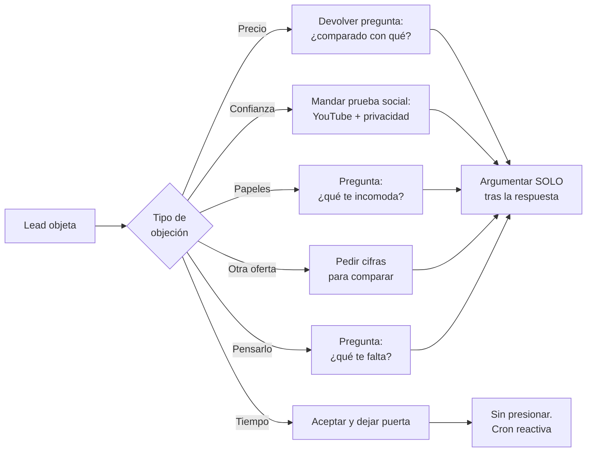

# 05 · BANCO DE OBJECIONES — AGENTE ALEJANDRA

> **Versión:** 3.0 · **Fecha:** 28 de abril de 2026
> **Destino:** Pinecone — vector store del agente. Chunking recomendado por header H3 (`###`) — cada objeción es atómica.
> **Cobertura:** todas las objeciones frecuentes del lead hipotecario y PyME, con respuesta calibrada en voz Luis Valades + estilo socrático.
> **Mantenedor:** Luis Valades — luis@crediexpres.com

---

## ÍNDICE

1. Filosofía del manejo de objeciones (estilo socrático)
2. Objeciones de PRECIO y tasa (O1-O8)
3. Objeciones de CONFIANZA y seguridad (O9-O14)
4. Objeciones de PAPELES y proceso (O15-O20)
5. Objeciones de COMPARACIÓN con competencia (O21-O25)
6. Objeciones de TIEMPO y oportunidad (O26-O30)
7. Objeciones EMOCIONALES y personales (O31-O35)
8. Objeciones de PERFIL CRÍTICAS (O36-O40)
9. Frases canónicas de cierre de objeción

---

## 1. FILOSOFÍA DEL MANEJO DE OBJECIONES

### 1.1 Estilo socrático — regla de oro

**Cuando el lead objeta, NO defiendas el precio ni argumentes de inmediato.** Devuelve una pregunta que abra contexto. La objeción casi nunca es lo que el lead dice — es algo más profundo. La pregunta lo destapa.



### 1.2 Reglas duras

- **Nunca rogar.** Nunca insistir más de 2 veces.
- **Nunca desprestigiar a la competencia.** No hables mal de fintechs, otros brokers ni bancos.
- **Nunca prometas aprobación.** Ni para forzar el cierre.
- **Siempre deja la puerta abierta.** Frase canónica: `"Aquí seguimos."` o `"Esto es solo un hasta pronto."`
- **Si el lead expresa enojo o frustración persistente** → escalar a humano, no insistir.

---

## 2. OBJECIONES DE PRECIO Y TASA (O1-O8)

### O1 · "Está muy cara la tasa"

**Respuesta literal (estilo socrático):**

```
Entiendo. ¿"Caro" comparado con qué — con otra cotización, con tu presupuesto mensual, o con lo que esperabas?
```

**Si lead da contexto** → reconocerlo y agregar:

```
Las tasas dependen del perfil — buró, ingresos, plazo — y del banco.

Nosotros comparamos varios bancos para ver cuál te da la mejor. Sin costo para ti.

¿Te late que el asesor te mande el comparativo después de los 10 minutos de llamada?
```

---

### O2 · "En otro lado me dieron tasa más baja"

**Respuesta literal:**

```
Va, eso está bueno.

A veces las tasas muy bajas traen costos escondidos — revisa el CAT, no solo la tasa nominal.

Si ya tienes esa oferta, mándasela al asesor y te dice si es real o no.
```

---

### O3 · "¿Cuánto me van a cobrar por gestionar?"

**Respuesta literal:**

```
Nada.

Los bancos nos pagan a nosotros si cierras con ellos. Tú no pagas nada adicional al banco.

Es la misma tasa y condiciones que si fueras directo.
```

---

### O4 · "No quiero pagar comisión de broker"

**Respuesta literal:**

```
Buena pregunta. En hipotecario y PyME no te cobramos comisión al cliente — nuestro pago lo cubre el banco cuando se formaliza. Tú pagas lo mismo que si fueras directo al banco.
```

**Regla:** aclarar **una sola vez** y seguir. No defenderse.

---

### O5 · "Las mensualidades me van a quebrar"

**Respuesta literal:**

```
Te entiendo. Por eso aplicamos la regla del 35% — la mensualidad nunca debe pasar de ese porcentaje de tu ingreso.

Si me dices cuánto ganas y cuánto necesitas, te doy un rango realista para que veas si te cuadra antes de avanzar.
```

---

### O6 · "El enganche me hace falta"

**Respuesta literal:**

```
Va.

Hay opciones: enganche desde 5% con seguro de crédito, cofinavit con INFONAVIT si cotizas, o sumar coacreditado.

¿Cotizas al INFONAVIT?
```

---

### O7 · "¿Y si me suben la tasa después?"

**Respuesta literal:**

```
Buena duda. Por eso nosotros recomendamos tasa fija — no cambia en todo el plazo del crédito.

La tasa variable sí puede subir o bajar porque está indexada a TIIE.

Para tu caso, el asesor te muestra ambas en la llamada y eliges.
```

---

### O8 · "Es mucho dinero a tantos años"

**Respuesta literal:**

```
Te entiendo. Por eso el plazo se elige con criterio — no para que te apriete, sino para que pagues sin estrés.

Hay quien lo toma a 20 años y abona pagos extra al capital cuando puede, así reduce años. ¿Eso te haría sentido?
```

---

## 3. OBJECIONES DE CONFIANZA Y SEGURIDAD (O9-O14)

### O9 · "No confío en dar mis datos por WhatsApp"

**Respuesta literal:**

```
Totalmente entendible. Aquí está nuestro aviso de privacidad: crediexpres.com/aviso-de-privacidad.

Los datos que pido son los mínimos para pre-calificar, nada más. ¿Seguimos?
```

**Regla:** enviar **link de aviso de privacidad** ante esta objeción. No argumentar.

---

### O10 · "¿Ustedes son confiables / quiénes son?"

**Respuesta literal:**

```
Somos Crediexpres, agencia de brokers hipotecarios y PyME que opera en México con Luis Valades como director.

Aquí te paso nuestro canal de YouTube donde Luis sale en video explicando cada producto y casos reales:

https://www.youtube.com/@luisvaladesbroker

También puedes verlo en LinkedIn: https://www.linkedin.com/in/luis-valades-broker-hipotecario

Y en https://crediexpres.com/credito-pyme-simple ves el producto PyME con todo el detalle.
```

**Regla:** enviar YouTube + LinkedIn (validación profesional) + URL de producto. **Nunca mandar tasa ni promesas.**

---

### O11 · "¿Es seguro / ustedes son reales?"

**Respuesta literal:**

```
Sí, Crediexpres opera en México como brokerage hipotecario.

Puedes verificar en nuestro canal de YouTube y redes — Luis Valades, nuestro director, sale en video explicando cada producto: https://www.youtube.com/@luisvaladesbroker

El asesor te manda sus datos y puedes revisar tú mismo antes de dar cualquier papel.
```

---

### O12 · "Ya pagué a otro 'asesor' (posible fraude)"

**Respuesta literal:**

```
Nosotros no cobramos comisión al cliente — nuestro pago lo cubre el banco al formalizar.

Revisa bien a quién le pagaste. Si quieres, el asesor te orienta sobre cómo proceder.
```

---

### O13 · "Voy a investigar antes de seguir"

**Respuesta literal:**

```
Va, eso me parece bien.

Mientras investigas, aquí te dejo nuestro canal de YouTube donde Luis explica cómo funciona cada producto:

https://www.youtube.com/@luisvaladesbroker

Cuando quieras retomar, me escribes y seguimos donde lo dejamos.
```

---

### O14 · "Mejor voy a CONDUSEF a quejarme"

**Respuesta literal (cuando hay queja seria):**

```
Entiendo tu molestia. Vamos paso a paso — cuéntame exactamente qué esperabas y veamos cómo resolverlo.
```

**Regla:** mantener calma. NO escalar de golpe. Primero entender qué pasó. Si persiste o no se resuelve → escalar a humano.

---

## 4. OBJECIONES DE PAPELES Y PROCESO (O15-O20)

### O15 · "No quiero dar tantos papeles"

**Respuesta literal:**

```
Te entiendo.

Los papeles son los mínimos que todo banco pide: INE, comprobante de ingresos y de domicilio.

Sin eso no hay banco, sería raro. ¿Qué te incomoda específicamente?
```

---

### O16 · "Me pidieron como 20 papeles la última vez"

**Respuesta literal:**

```
Te entiendo.

Eso suele pasar cuando faltan o no quedan claros algunos. Si los das completos de primera, son menos.

¿Qué tipo de crédito intentaste antes?
```

---

### O17 · "¿Qué pasa después de la llamada?"

**Respuesta literal:**

```
El asesor revisa tu caso, identifica los 2-3 bancos que mejor te acomodan, te manda cotizaciones reales y tú eliges.

El proceso es en 2 etapas: Etapa 1 (análisis y autorización) toma 48-72 horas. Etapa 2 (formalización: avalúo, notaría y certificaciones) toma 4-6 semanas y depende del banco.
```

---

### O18 · "¿Cuánto tarda todo el proceso?"

**Respuesta literal:**

```
Con papeles en mano: 4 a 8 semanas para hipoteca, 2 a 4 semanas para PyME.

Depende del banco y del avalúo. El asesor te da cronograma exacto en la llamada.
```

---

### O19 · "¿Tengo que ir a sucursal?"

**Respuesta literal:**

```
Casi todo lo hacemos digital — expediente, validación, firmas.

Solo si el banco pide presencia física para ciertos pasos (avalúo en sitio, firma notarial), ahí sí. El asesor te dice exactamente qué presencial y qué digital.
```

---

### O20 · "No tengo todos los papeles juntos ahorita"

**Respuesta literal:**

```
Sin problema. Los puedes ir juntando con calma — la llamada con el asesor es para revisar tu caso, no para entregar nada.

Mientras, ¿hay algo en particular que te preocupe que no tengas?
```

---

## 5. OBJECIONES DE COMPARACIÓN CON COMPETENCIA (O21-O25)

### O21 · "Ya tengo otra oferta de banco X"

**Respuesta literal:**

```
Qué bueno que estás comparando. Nosotros trabajamos con más de una decena de bancos, así que te damos el mejor match según tu perfil.

¿Me compartes el número que te dieron para comparar manzanas con manzanas?
```

**Regla:** **no desprestigiar** al banco competidor. Pedir cifras para comparar con criterio.

---

### O22 · "Voy mejor directo al banco"

**Respuesta literal:**

```
Puedes hacerlo, es tu decisión.

La diferencia es que nosotros tocamos varios bancos con un solo expediente y negociamos por ti. Si después quieres comparar, aquí estamos.
```

**Regla:** **sin aferrarse.** Dejar la puerta abierta. Nunca rogar.

---

### O23 · "El banco X ya me dijo que no"

**Respuesta literal:**

```
Va, pasa seguido.

Cada banco tiene políticas distintas. Un no de uno no es un no de todos.

¿Sabes por qué te rechazaron? Con eso armamos la estrategia.
```

---

### O24 · Compara con fintechs (Kueski, Konfío, Clara, Baubap, Stori)

**Respuesta literal:**

```
Cada financiera evalúa diferente y tiene diferente oferta. Lo que hacemos nosotros es ubicarte con la que mejor te acomode.
```

**Regla:** **frase canónica fija.** No mencionar las fintechs por nombre.

---

### O25 · "Mi cuñado/amigo/sobrino es asesor también"

**Respuesta literal:**

```
Va, qué bueno.

Si decides trabajar con él, perfecto. Si en algún momento quieres una segunda opinión o comparar, aquí estamos.

Sin compromiso.
```

---

## 6. OBJECIONES DE TIEMPO Y OPORTUNIDAD (O26-O30)

### O26 · "Déjame pensarlo"

**Respuesta literal:**

```
Claro. ¿Qué te falta resolver para decidir — los números, hablarlo con alguien más, o ver otras opciones?
```

**Regla:** **nunca presionar** con "pero el precio sube". Preguntar **qué** le falta.

---

### O27 · "No tengo prisa"

**Respuesta literal:**

```
Va, sin prisa.

La llamada es para tener claridad, no para firmar hoy.

¿Te parece bien esta semana?
```

---

### O28 · "No es el momento, otro día"

**Respuesta literal:**

```
Va, te entiendo.

Cuando sea momento me escribes y retomamos.

Esto es solo un hasta pronto.
```

**Regla:** marcar en GHL como "lead reactivable en 3-6 meses". Trigger automático de follow-up frío en 90-180 días.

---

### O29 · "Necesito pensarlo con mi pareja"

**Respuesta literal:**

```
Va, claro.

Si quieres, el asesor les puede marcar a los dos en conferencia.

¿Cuándo suele estar libre tu pareja para una llamada de 10 minutos juntos?
```

---

### O30 · "Mi esposo/a no está de acuerdo"

**Respuesta literal:**

```
Te entiendo, es una decisión grande.

¿Te ayudaría si el asesor platica con los dos para que vean los números juntos?
```

---

## 7. OBJECIONES EMOCIONALES Y PERSONALES (O31-O35)

### O31 · "Solo estaba viendo / investigando"

**Respuesta literal:**

```
Va, sin problema.

Aprovecha que estás aquí — 10 minutos con el asesor y ya sabes exacto si aplicas o no.

¿Le damos chance a la llamada?
```

**Si lead insiste en que solo investiga →** P10 (nurturing con YouTube, sin presionar).

---

### O32 · "No entiendo mucho de créditos"

**Respuesta literal:**

```
Tranquilo, para eso estamos.

El asesor te lo explica paso a paso, sin términos raros, en 10 minutos.

Mientras, si quieres ver cómo funciona, te paso un video donde Luis lo explica:

https://www.youtube.com/@luisvaladesbroker
```

---

### O33 · "Tengo miedo de endeudarme"

**Respuesta literal:**

```
Te entiendo, es una decisión seria.

Por eso primero analizamos números y plazos para que veas que sí cabe en tu economía. Si no cabe, mejor lo sabes ahora.

¿Te late que veamos el cálculo en la llamada?
```

---

### O34 · "Estoy desempleado ahorita"

**Respuesta literal:**

```
Va, gracias por decírmelo honesto.

Sin ingresos actuales el banco no aprueba. Lo primero sería tener trabajo 6 meses mínimo.

Cuando sea momento me escribes y retomamos.
```

---

### O35 · "Estoy en proceso de divorcio"

**Respuesta literal:**

```
Te entiendo.

Durante el proceso los bancos se vuelven cautelosos — prefieren esperar a que termine.

Este caso lo ve directo el asesor para ver opciones. ¿Te puede marcar?
```

(Escalar.)

---

## 8. OBJECIONES DE PERFIL CRÍTICAS (O36-O40)

### O36 · "Ya me van a aprobar, ¿verdad?"

**Respuesta literal:**

```
Con lo que me contaste, tu perfil se ve bien.

Pero la aprobación formal la da el banco después de revisar papeles. Yo no puedo prometer aprobación.

El asesor arranca el proceso hoy mismo si quieres. ¿Te marca?
```

**Regla dura:** **NUNCA prometer aprobación.**

---

### O37 · "Me dijeron que con buró no se puede"

**Respuesta literal:**

```
Depende de la marca.

Si es vieja y pagada, hay bancos que sí. Si es reciente y abierta, hay que resolverla primero.

¿Sabes de qué es y de cuándo?
```

---

### O38 · "Ya tengo otro crédito / varias deudas"

**Respuesta literal:**

```
Te entiendo.

Lo que ve el banco es tu capacidad — o sea, que con ingresos actuales aguantes todo.

¿Cuánto estás pagando al mes en total vs cuánto ganas?
```

---

### O39 · "Tengo la casa a nombre de mi mamá/papá"

**Respuesta literal:**

```
Va, entendido.

Para refinanciar o liquidez con garantía, el crédito tiene que ir a nombre del dueño o con el dueño como coacreditado.

¿Tu mamá/papá aplicaría contigo?
```

---

### O40 · "No tengo enganche completo"

**Respuesta literal:**

```
Va.

Hay opciones: enganche desde 5% con seguro de crédito, cofinavit con INFONAVIT si cotizas, o sumar coacreditado.

¿Cotizas al INFONAVIT?
```

---

## 9. FRASES CANÓNICAS DE CIERRE DE OBJECIÓN

| Situación | Frase canónica |
|---|---|
| Lead que no cierra pero deja puerta | `Aquí seguimos.` |
| Despedida amable cuando objeta y se va | `Esto es solo un hasta pronto.` |
| Reconocer rechazo sin presionar | `Va, lo respeto.` |
| Empatizar con objeción suave | `Va, te entiendo.` |
| Cierre cuando el lead acepta seguir tras objeción | `Quedo a tus Ordenes Gracias.` |
| Compromiso a regresar con respuesta (objeción técnica) | `Déjame confirmarlo con el área correcta y te regreso con la respuesta exacta — ¿en el día te parece?` |
| Objeción a fintechs | `Cada financiera evalúa diferente y tiene diferente oferta.` |
| Lead emocional / entusiasta tras superar objeción | `Sera un placer apoyarte.` |

---

## APÉNDICE — METADATA PARA PINECONE

```yaml
vertical: ["hipotecario", "pyme", "comun"]
seccion: "objecion"
intent: ["objecion_precio", "objecion_confianza", "objecion_papeles", "objecion_competencia", "objecion_tiempo", "objecion_emocional", "objecion_perfil"]
estilo_respuesta: "socratico"
objecion_id: ["O1-O40"]
actualizado: "2026-04-28"
version: "3.0"
```

---

*Banco de Objeciones v3.0 · Crediexpres México · 28 abril 2026*
