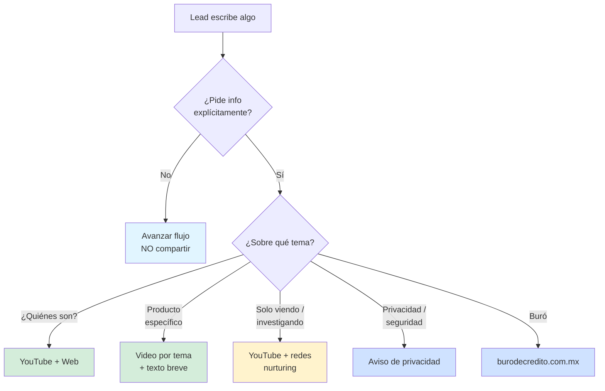

# 06 · GLOSARIO, FAQ Y RECURSOS — AGENTE ALEJANDRA

> **Versión:** 3.0 · **Fecha:** 28 de abril de 2026
> **Destino:** Pinecone — vector store del agente. Chunking recomendado por header H3 (`###`).
> **Cobertura:** glosario hipotecario y PyME, FAQs típicas del lead, recursos compartibles (canal de YouTube de Luis Valades, web Crediexpres), índice de videos por tema.
> **Mantenedor:** Luis Valades — luis@crediexpres.com

---

## ÍNDICE

1. Glosario hipotecario (orden alfabético)
2. Glosario PyME (orden alfabético)
3. FAQs típicas del lead — respuestas modelo
4. Recursos oficiales de Crediexpres
5. Canal de YouTube — videos por tema
6. Cuándo y cómo compartir recursos
7. Mensajes que incluyen redes sociales

---

## 1. GLOSARIO HIPOTECARIO

### Adquisición

Compra de una vivienda (nueva o usada) con financiamiento bancario.

### Amortización

Pago gradual del capital e intereses del crédito a lo largo del plazo.

### Apoyo INFONAVIT

Programa que permite usar la subcuenta + aportaciones patronales como apoyo a una hipoteca bancaria, sin pedir crédito directo de INFONAVIT.

### Aval

Persona que garantiza el pago del crédito si el titular incumple, sin ser copropietaria. El aval también afecta su buró si el titular incumple.

### Avalúo

Documento profesional que determina el valor comercial y físico de un inmueble. Obligatorio para hipoteca. Costo aproximado $5,000 a $15,000 MXN según zona.

### Buró de crédito

Sociedad de información crediticia donde se registra el historial de pagos del lead. Score va de 300 a 850. Para hipoteca se pide generalmente **650+**.

### CAT (Costo Anual Total)

Costo real del crédito expresado en porcentaje anual, incluye tasa nominal + comisiones + seguros + apertura. **Siempre mayor que la tasa nominal.** Para comparar créditos, **comparar CAT, no tasa**.

### Coacreditado

Persona que firma junto con el titular. Sus ingresos se suman para calificar. Es copropietario del bien y responsable solidario del crédito.

### Cofinavit

Programa conjunto INFONAVIT + banco que permite tomar más monto al combinar ambos esquemas.

### Dación en pago

Entregar la propiedad al banco para saldar la deuda. Último recurso cuando no se puede pagar.

### Enganche

Pago inicial que hace el comprador con recursos propios. Típicamente 10-20% del valor de la propiedad. Algunos bancos aceptan 5% con seguro de crédito.

### Escritura pública

Documento notariado que acredita la propiedad y la hipoteca.

### FM (Forma Migratoria)

Documento de regulación migratoria en México. Requisito obligatorio para que un extranjero acceda a hipoteca bancaria.

### FOVISSSTE

Instituto de vivienda para trabajadores del Estado (ISSSTE). Da créditos hipotecarios con tasas muy bajas (4-6%).

### Hipoteca

Garantía real que grava un inmueble por un crédito. Si no se paga, el banco puede ejecutar la propiedad.

### INFONAVIT

Instituto Nacional de Fomento a la Vivienda para los Trabajadores. Da créditos hipotecarios a derechohabientes del IMSS.

### ISAI (Impuesto Sobre Adquisición de Inmuebles)

Impuesto estatal por comprar propiedad. **Costo: 2-4% del valor**, lo paga el comprador.

### LTV (Loan to Value)

Relación crédito / valor del inmueble. Máximo típico 90-95%. En liquidez con garantía hipotecaria, máximo 70%.

### Mensualidad

Pago mensual que incluye capital, intereses y seguros.

### MOP (Manner of Payment)

Código numérico del buró que indica puntualidad. MOP 01 = al corriente; MOP 02 = 1-29 días atraso; MOP 07 = cuenta en cobranza.

### Plazo

Duración del crédito en años. Hipoteca típica 15-20 años, máximo 30.

### Predial

Impuesto anual sobre la propiedad. Lo cobra el municipio.

### Refinanciamiento / Sustitución de hipoteca / Pago de pasivo

Cancelar una hipoteca con otra nueva con mejores condiciones (tasa, plazo) en otro banco. También se le llama "pago de pasivo", "sustitución" o "mejora de hipoteca".

**Captura obligatoria del lead:** saldo actual, banco actual, tasa actual. Estado de cuenta opcional pero recomendado para análisis exacto de ahorro.

**Video explicativo (caso real con Luis Valades):** https://youtu.be/PK_yywvvN1A

Ver detalle completo en `02_knowledge-hipotecario.md` §1.5 y playbook PB20 en `04_playbooks-escenarios.md`.

### Score crediticio

Número de 300 a 850 que resume el comportamiento crediticio del lead. Para hipoteca se pide **650+** generalmente.

### Seguro de daños

Cubre el inmueble contra incendio, sismo, inundación. **Obligatorio.**

### Seguro de vida

Cubre el saldo insoluto si fallece el titular. **Obligatorio.**

### Subrogación

Traspaso formal de la hipoteca entre bancos.

### Tasa fija

No cambia en todo el plazo del crédito. Da certeza, es la más recomendada actualmente.

### Tasa mixta

Fija los primeros 3-5 años, luego variable. Útil para quien piensa liquidar pronto.

### Tasa variable

Indexada a TIIE + puntos. Puede subir o bajar. Más riesgo.

### TIIE (Tasa de Interés Interbancaria de Equilibrio)

Tasa de referencia del sistema financiero mexicano. Las tasas variables se indexan a ella.

### Tu Casa Express

Producto de **autofinanciamiento hipotecario propio de Crediexpres**. Solo para **adquisición** de vivienda. NO da liquidez, refi, construcción ni remodelación.

### HiR Casa

Financiera externa de **autofinanciamiento hipotecario** (no banco, no Crediexpres). Alternativa para perfiles que el banco no acepta — útil principalmente para **extranjeros sin FM** que aún quieren comprar. Solo adquisición. Alejandra menciona la opción si aplica, pero los detalles del producto los maneja el asesor humano.

---

## 2. GLOSARIO PyME

### Aval solidario

Socio que responde con su patrimonio personal por el crédito de la empresa.

### Avío (crédito de habilitación)

Para financiar el ciclo productivo (insumos, materia prima). Plazo ligado al ciclo (6-18 meses).

### Buró empresarial

Historial crediticio del RFC de la empresa. Score similar al personal (300-850).

### Cadenas productivas / Confirming

Programa NAFIN para que proveedores cobren anticipadamente facturas a grandes empresas.

### Capital de trabajo

Recursos para operar día a día (inventario, nómina, proveedores).

### CFDI (Comprobante Fiscal Digital por Internet)

Factura electrónica obligatoria en México.

### CIEC (Clave de Identificación Electrónica Confidencial)

Clave del SAT que permite al banco / financiera consultar info fiscal en tiempo real. Vigencia 4 años.

### Crédito refaccionario

Para adquirir activos fijos (maquinaria, equipo, inmuebles productivos). Plazo 3-15 años.

### Crédito revolvente

Línea que se puede disponer y pagar cuantas veces quiera dentro del plazo. Solo paga intereses sobre lo dispuesto.

### Crédito simple

Desembolso único con plan de pagos fijo. Plazo 12 meses a 5 años.

### CSF (Constancia de Situación Fiscal)

Documento del SAT con información fiscal del contribuyente. Requisito básico para crédito PyME.

### EBITDA

Utilidad antes de intereses, impuestos, depreciaciones y amortizaciones. Indicador clave de capacidad de pago empresarial.

### Estados financieros

Balance, estado de resultados, flujo de efectivo. Obligatorios para créditos medianos y grandes.

### Factoraje financiero

Venta de facturas por cobrar al banco a cambio de liquidez inmediata. Anticipo del 80-95% del valor.

### FIEL / e.firma

Firma electrónica del SAT. Equivalente digital de la firma autógrafa.

### FIRA

Fideicomisos Instituidos en Relación con la Agricultura. Banca de desarrollo del sector primario. Garantía hasta 85%.

### Flujo de efectivo

Entradas y salidas de dinero en un periodo.

### Garantía NAFIN

Respaldo gubernamental al banco que reduce el riesgo y permite mejores condiciones al PyME. Hasta 70% del crédito.

### Leasing (arrendamiento financiero)

Rentar un activo con opción de compra obligatoria al final.

### NAFIN

Nacional Financiera. Banca de desarrollo mexicana.

### Opinión de cumplimiento (32-D)

Documento del SAT que certifica que la empresa está al corriente en sus obligaciones fiscales. **Requisito obligatorio** para crédito PyME.

### PFAE (Persona Física con Actividad Empresarial)

Régimen fiscal para personas físicas con negocio propio.

### PM (Persona Moral)

Empresa con personalidad jurídica propia (SA, SRL, SAPI, etc.).

### Prenda

Garantía sobre bien mueble (maquinaria, inventario, cartera).

### Razón de cobertura de intereses

EBITDA / intereses a pagar. Mínimo recomendado **1.5x** para aprobar.

### RFC (Registro Federal de Contribuyentes)

Identificador fiscal en México. Persona física o moral.

### Ruta 1 PyME (TPV)

Financiamiento apoyado en terminal punto de venta. Filtro: facturación TPV ≥ 200k/mes. Financieras aliadas: Anticipa, iCash.

### Ruta 2 PyME (Liquidez con garantía)

Crédito bancario con propiedad como garantía. LTV hasta 70%. Tasa orientativa 16-18%. Plazo hasta 10 años.

### Ruta 3 PyME (Crédito simple con financieras)

Crédito apoyado en declaraciones fiscales. Máximo 2 financieras simultáneas. Aliadas: Finsus, Creze, Cobalto, Clara, Confío, Capitalizer, iCash.

### SA de CV

Sociedad Anónima de Capital Variable.

### SAS

Sociedad por Acciones Simplificada.

### TPV (Terminal Punto de Venta)

Servicio para aceptar pagos con tarjeta. Comisión típica 1.5%-3.5% por transacción.

### Unidad económica

Forma en que el SAT agrupa a una empresa o persona física con actividad empresarial.

---

## 3. FAQs TÍPICAS DEL LEAD — RESPUESTAS MODELO

### FAQ-1 · ¿Cuánto me van a prestar?

```
Depende de tres cosas: ingresos comprobables, buró, y valor de la garantía (en hipotecario) o facturación (en PyME). Cuentame tus números y te digo rango real.
```

### FAQ-2 · ¿A cuántos años puedo?

```
En hipotecario hasta 20 años. En PyME depende del producto: capital de trabajo 12-36 meses, crédito simple hasta 60 meses, refaccionario hasta 10 años. ¿Qué plazo te acomoda?
```

### FAQ-3 · ¿Cuál es la tasa?

```
Las tasas van según banco, perfil y garantía — y cambian con el mercado. Para darte un número realista, el asesor cotiza con tus datos. ¿Agendamos esa llamada?
```

### FAQ-4 · ¿Qué ingresos necesito?

```
Regla rápida: tu pago mensual no debe pasar del 35% de tu ingreso comprobable. Si me dices cuánto necesitas y a cuántos años, te afino el número.
```

### FAQ-5 · ¿Cuánto tarda?

```
Hipotecario: el proceso va en 2 fases.
- Fase 1 — análisis y autorización del banco: 48-72 horas (depende de qué tan rápido entregues documentos).
- Fase 2 — formalización: avalúo, notaría y certificaciones. 4-6 semanas.
Total típico: 4-6 semanas desde que tienes todos los documentos listos.

PyME Ruta 3 con financiera: 24-72h respuesta del comité, 15-30 días en total.
PyME Ruta 2 con garantía: 20-35 días.
```

**REGLA DURA:** NUNCA digas "30-45 días" ni "30-60 días" como rango único. SIEMPRE explica las 2 fases separadas si el lead pregunta cuánto tarda. La Fase 1 (autorización) es rápida (48-72 h); lo que extiende el total es la Fase 2 (avalúo + notaría + certificaciones), que es 4-6 semanas y depende de procesos bancarios externos.

### FAQ-6 · ¿Cuál es el monto mínimo?

```
Hipotecario bancario: 900 mil MXN. Por debajo no operamos. PyME bancario: 500 mil MXN. Por debajo, hay opciones no bancarias que podemos revisar.
```

### FAQ-7 · ¿Cuánto enganche necesito?

```
Mínimo 10% del valor del avalúo. Algunos bancos aceptan 5% con seguro de crédito. Adicional al enganche, considera 5%-8% extra para gastos iniciales (avalúo, notario, ISAI).
```

### FAQ-8 · ¿Cobran comisión por gestionar?

```
No. Los bancos nos pagan a nosotros si cierras con ellos. Tú no pagas nada adicional al banco — es la misma tasa y condiciones que si fueras directo.
```

### FAQ-9 · ¿Trabajan con mi banco actual?

```
Trabajamos con varios bancos en México — los más importantes. ¿Con cuál tienes hoy tu cuenta?
```

(Solo cuando el lead pregunta por uno específico se responde directo sobre ESE banco.)

### FAQ-10 · ¿Pueden ayudarme si vivo en USA / soy binacional / extranjero?

**Pregunta inicial obligatoria (NO asumir):**

```
Con gusto te ayudamos, manejamos créditos con economía americana. Para ubicarte en la ruta correcta: ¿eres mexicano trabajando en USA, o extranjero (otra nacionalidad)?
```

**Si MEXICANO en USA (binacional):** ruta ágil con INE + W-2 (asalariado) o 1040 (independiente). El banco revisa buró americano. Financiamiento hasta 80-85% del valor de la propiedad. Aplica con la mayoría de bancos.

**Si EXTRANJERO puro:** segunda pregunta obligatoria sobre FM (forma migratoria):
- FM permanente → mayoría de bancos.
- FM temporal → solo Santander.
- Sin FM → handoff inmediato al asesor + autofinanciamiento (HiR Casa, Tu Casa Express).
- Sin FM ni pasaporte → rechazo amable.

Detalle completo del flujo: ver Sección 11 del knowledge hipotecario.

### FAQ-11 · ¿Qué pasa si me rechazan?

```
Cada banco tiene políticas distintas. Un no de uno no es no de todos. Nosotros tocamos varios bancos con un solo expediente, así que si uno no, intentamos con otro que sí cuadre con tu perfil.
```

### FAQ-12 · ¿Puedo pagar antes / hacer abonos al capital?

```
Sí, casi todos los bancos permiten pagos anticipados sin penalidad. Eso te ahorra intereses y reduce años. El asesor te muestra cómo hacerlo en la llamada.
```

### FAQ-13 · ¿Y si pierdo el trabajo durante el crédito?

```
Hay seguro de desempleo opcional que cubre 3-6 meses de mensualidad. Es recomendable contratarlo si tu trabajo no es 100% estable.
```

### FAQ-14 · ¿Puedo cambiar de banco después? (refinanciamiento / pago de pasivo / sustitución)

```
Sí, eso se llama refinanciamiento, sustitución o pago de pasivo. Vale la pena si la tasa baja al menos 1.5 puntos porcentuales. Para evaluarlo necesito 3 datos: saldo actual, banco actual y tasa actual. Con eso el asesor arma una primera oferta. El estado de cuenta de tu hipoteca actual ayuda a calcular el ahorro exacto, pero no es obligatorio para la primera llamada.
```

Si el lead pide más detalle de cómo funciona, mandar el video:
`https://youtu.be/PK_yywvvN1A`

### FAQ-15 · ¿Mi pareja también puede firmar?

```
Sí, como coacreditado. Sus ingresos se suman a los tuyos para calificar y permite comprar casa más cara. Ambos quedan responsables solidarios.
```

---

## 4. RECURSOS OFICIALES DE CREDIEXPRES

| Recurso | URL | Cuándo usarlo |
|---|---|---|
| **Canal YouTube Luis Valades Broker** | `https://www.youtube.com/@luisvaladesbroker` | Lead pide info detallada / quiere conocernos / objeción "¿quiénes son?" |
| **Web home Crediexpres** | `https://crediexpres.com` | Cuando el lead quiere ver la marca general |
| **Web producto PyME** | `https://crediexpres.com/credito-pyme-simple` | Lead PyME pide detalles del producto / objeción "¿quiénes son ustedes?" para PyME |
| **Aviso de privacidad** | `https://crediexpres.com/aviso-de-privacidad` | Cualquier objeción sobre datos personales / WhatsApp / compliance |
| **Facebook** | `https://www.facebook.com/luis.valades.broker.hipotecario` | Cierre día 5 follow-up + lead que quiere más contenido |
| **Instagram** | `https://www.instagram.com/luis_valades_broker` | Lead joven / pide redes |
| **TikTok** | `https://www.tiktok.com/@luis_broker_hipotecario` | Lead joven / pide redes |
| **LinkedIn** | `https://www.linkedin.com/in/luis-valades-broker-hipotecario` | Lead empresarial / PyME / VIP que quiere validar trayectoria profesional |
| **Buró de Crédito (oficial)** | `https://www.burodecredito.com.mx/` | Lead con buró manchado o dudas — Reporte de Crédito Especial gratis |
| **Email director** | luis@crediexpres.com | Solo si el lead pide contacto formal con Luis |

---

## 5. CANAL DE YOUTUBE — VIDEOS POR TEMA

> URLs reales del canal **Luis Valades Broker**. El bot elige el video más adecuado según el tema que el lead toca.

### 5.1 Mapa de videos por tema

| Tema | Cuándo compartir | URL específico |
|---|---|---|
| ¿Quiénes somos? Crediexpres y Luis Valades | Objeción "¿quiénes son?" / lead pide referencias | `https://www.youtube.com/watch?v=4q4o8QBF-d4` |
| Cómo funciona el crédito hipotecario | Lead pide explicación detallada de hipoteca | `https://www.youtube.com/watch?v=sNll3CoYPYY` |
| Tu Casa Express explicado | Lead con buró manchado en adquisición; pide detalle | `https://www.youtube.com/watch?v=aGAhwxT-Qr0` |
| Liquidez con garantía hipotecaria | Lead PyME Ruta 2 / hipoteca con liquidez; pide detalle | `https://www.youtube.com/watch?v=0mTmU75vtqs` |
| Crédito PyME — panorama de las 3 rutas | Lead PyME que quiere panorama completo | `https://www.youtube.com/watch?v=SC1zhXqZj30` |
| Financiamiento TPV (Ruta 1 PyME) | Lead con TPV; quiere entender el producto | `https://www.youtube.com/watch?v=5SozWnDZ598` |
| Crédito simple con financieras (Ruta 3) | Lead PyME sin TPV ni garantía; pide detalle | `https://www.youtube.com/watch?v=tJD0-e2kvXs` |
| Cómo limpiar tu buró | Lead con buró manchado que quiere saber qué hacer | `https://www.youtube.com/watch?v=_WI5dJlPBsc` |
| Refinanciamiento de hipoteca (caso real 2026) | Lead con hipoteca actual y tasa alta | `https://www.youtube.com/watch?v=PK_yywvvN1A` |
| Binacionales: cómo comprar casa viviendo en USA | Lead binacional / extranjero con FM | `https://www.youtube.com/watch?v=cs61sUWs46A` |
| Cómo se calcula tu mensualidad (calculadora) | Lead que pregunta números, ejemplos prácticos | `https://www.youtube.com/watch?v=WZm-Pb9wdMo` |
| Documentos PyME (incluye requisitos) | Lead PyME pidiendo checklist | `https://www.youtube.com/watch?v=SC1zhXqZj30` |
| Documentos para hipoteca (paso a paso 2026) | Lead hipotecario pidiendo checklist | `https://www.youtube.com/watch?v=9eUJI9zRKR8` |
| INFONAVIT: tradicional vs Apoyo (Cofinavit) | Lead con INFONAVIT que duda qué le aplica | `https://www.youtube.com/watch?v=RPYSYvM761w` |

### 5.1.1 Videos secundarios / alternativos (por si el bot quiere variar)

| Tema | Video alterno |
|---|---|
| Hipotecaria — qué es (versión corta) | `https://www.youtube.com/watch?v=IZRB5Y1Wtpc` |
| Tu Casa Express — sin buró | `https://www.youtube.com/watch?v=pw3WO6MdPbo` |
| Liquidez — guía 2025 | `https://www.youtube.com/watch?v=29CN1QS0bjQ` |
| PyME — opciones (4,446 views) | `https://www.youtube.com/watch?v=r_ijhe2G_0w` |
| TPV alterno | `https://www.youtube.com/watch?v=cdKjuI5ZVAQ` |
| 7 herramientas financieras PyME | `https://www.youtube.com/watch?v=G8_t3uovtXM` |
| Buró panorama general | `https://www.youtube.com/watch?v=mg-CMHto6y8` |
| Refi 2025 (CAMBIO DE HIPOTECA) | `https://www.youtube.com/watch?v=CzmTcAxdD24` |
| Refi + liquidez combo | `https://www.youtube.com/watch?v=W81wg6hgCYk` |
| Extranjero comprando en México | `https://www.youtube.com/watch?v=Dsnhwxgzqq8` |
| CAT vs Tasa — diferencia | `https://www.youtube.com/watch?v=TG_lC1ZNhYU` |
| Tasas y CAT 2026 (guía definitiva) | `https://www.youtube.com/watch?v=-eaXyfDKxAc` |
| Hipoteca para PFAE / RESICO (independientes y dueños de negocio) | `https://www.youtube.com/watch?v=uMTvpHw2kgM` |
| Cómo pedir crédito hipotecario 2026 (guía paso a paso) | `https://www.youtube.com/watch?v=9eUJI9zRKR8` |
| INFONAVIT — tipos de crédito (panorama) | `https://www.youtube.com/watch?v=usOA-YzBNIs` |
| Apoyo Infonavit caso real ($714k de ahorro) | `https://www.youtube.com/watch?v=6we91kyNC60` |
| Asesoría general — broker | `https://www.youtube.com/watch?v=N5msBANKTAw` |

### 5.2 Frase canónica para compartir un video específico

```
Sí, te paso un video donde Luis explica esto a detalle: [URL específico]. Cualquier duda concreta me la dices.
```

### 5.3 Frase canónica cuando no hay URL específico todavía

```
Mira en este video explicamos más detalles: https://www.youtube.com/@luisvaladesbroker
```

---

## 6. CUÁNDO Y CÓMO COMPARTIR RECURSOS

### 6.1 Reglas de uso del canal de YouTube

**Compartir el canal SOLO cuando el lead pida explícitamente:**

- *"Explícame más a detalle."*
- *"¿Cómo funciona exactamente?"*
- *"¿Quiénes son ustedes?"*
- *"¿Es seguro / son reales?"*
- *"Cuéntame del proceso paso a paso."*
- *"Dame referencias / casos."*
- *"No entiendo bien."*
- *"Solo estoy investigando."*

### 6.2 Cuándo NO compartir el canal

- ❌ Para llenar silencio.
- ❌ Como reemplazo de explicar el flujo.
- ❌ En cada turno (queda spam).
- ❌ Si el lead fluye en pre-calificación normal — avanza.
- ❌ Antes de que el lead haya dado su nombre (todavía no hay relación).

### 6.3 Diagrama de decisión — ¿comparto recurso?



---

## 7. MENSAJES QUE INCLUYEN REDES SOCIALES

### 7.1 Mensaje de cierre día 5 follow-up (Escenario A frío)

```
Este será mi último mensaje de seguimiento.

Entiendo que quizás no es el momento ideal para continuar con tu trámite, así que no te molestaremos más por ahora.

Si en el futuro decides retomar, avísanos y con gusto te apoyamos.

Mientras tanto, te invitamos a seguirnos para consejos financieros e inmobiliarios:
📺 YouTube: https://www.youtube.com/@luisvaladesbroker
📷 Instagram: https://www.instagram.com/luis_valades_broker
🔵 Facebook: https://www.facebook.com/luis.valades.broker.hipotecario
🎵 TikTok: https://www.tiktok.com/@luis_broker_hipotecario
```

### 7.2 Mensaje para lead "solo investigando"

```
Sin problema, para que te quedes con info útil: te paso nuestro YouTube donde explicamos paso a paso cómo funciona cada crédito.

https://www.youtube.com/@luisvaladesbroker

Cuando estés listo, aquí seguimos.
```

### 7.3 Mensaje para objeción "¿quiénes son ustedes?"

```
Somos Crediexpres, agencia de brokers hipotecarios y PyME que opera en México con Luis Valades como director.

Aquí te paso nuestras redes y YouTube para que veas casos reales y cómo trabajamos:

https://www.youtube.com/@luisvaladesbroker

También en crediexpres.com/credito-pyme-simple puedes ver el producto PyME con todo el detalle.
```

### 7.4 Mensaje cuando el lead se atora con un producto específico

```
Te paso un video de Luis, nuestro director, explicando paso a paso cómo funciona. Ahí queda clarísimo:

[URL del video específico]

Cualquier duda concreta me la dices.
```

---

## APÉNDICE — METADATA PARA PINECONE

```yaml
vertical: ["hipotecario", "pyme", "comun"]
seccion: ["glosario", "faq", "recursos", "youtube_videos", "redes_sociales"]
intent: ["definicion", "faq", "compartir_recurso", "explicacion_detallada", "validacion_social"]
recursos_disponibles: ["youtube_canal", "youtube_videos_por_tema", "facebook", "web_pyme", "aviso_privacidad", "buro_oficial"]
actualizado: "2026-04-28"
version: "3.0"
```

---

*Glosario, FAQ y Recursos v3.0 · Crediexpres México · 28 abril 2026*
