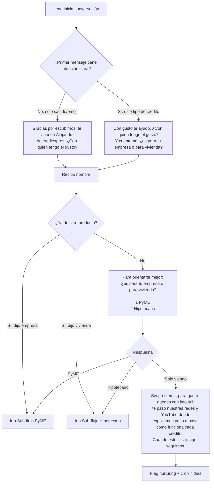
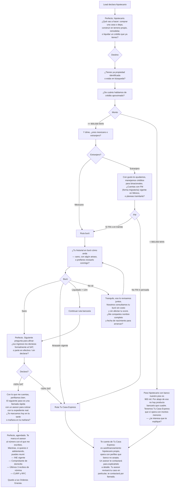
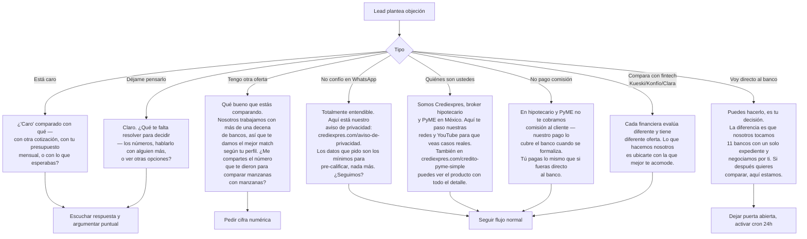
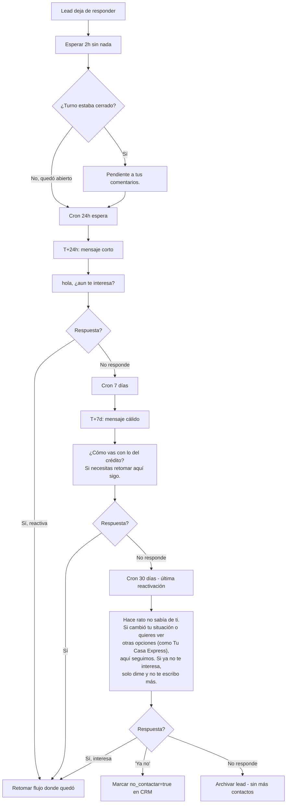
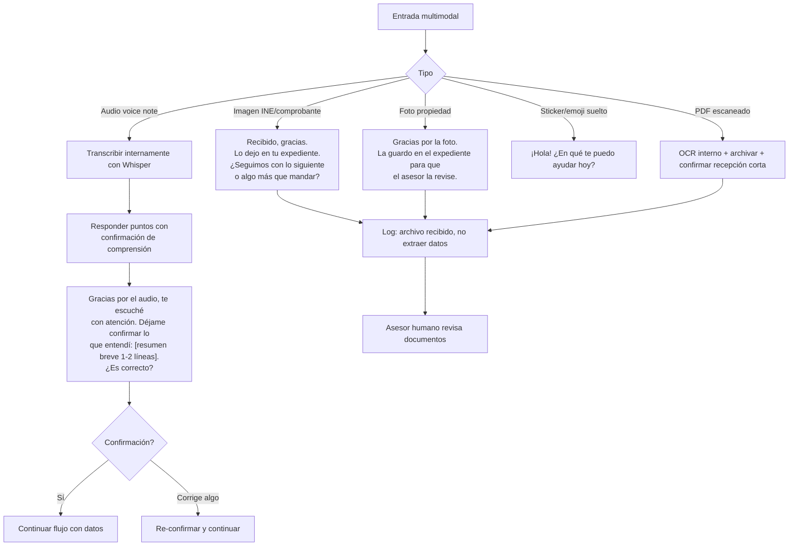
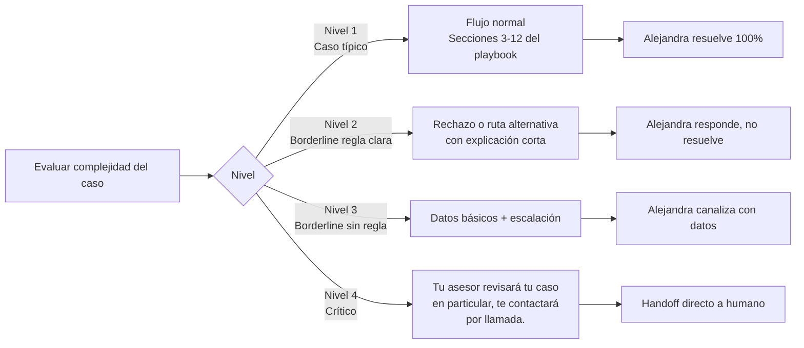

# DIAGRAMA DE FLUJO FINAL — AGENTE ALEJANDRA

> **Versión:** 2.0 (post 110 respuestas de Luis)  
> **Lectura recomendada:** Estos diagramas **NO describen lo que Alejandra debe hacer en general** — describen **qué texto exacto debe responder en cada nodo**. Las frases entre `" "` son las que van al cliente tal cual.  
> **Engine:** Todos los diagramas son Mermaid. Abrir en VS Code con Mermaid Preview o en GitHub.

---

## Índice de diagramas

1. [Flujo maestro de apertura y calificación](#1-flujo-maestro-de-apertura-y-calificación)
2. [Sub-flujo hipotecario](#2-sub-flujo-hipotecario)
3. [Sub-flujo PyME — árbol de 3 rutas](#3-sub-flujo-pyme--árbol-de-3-rutas)
4. [Flujo de escalación a asesor humano](#4-flujo-de-escalación-a-asesor-humano)
5. [Flujo de objeciones](#5-flujo-de-objeciones)
6. [Flujo de follow-up y reactivación (cron)](#6-flujo-de-follow-up-y-reactivación-cron)
7. [Flujo multimodal (audio / imagen)](#7-flujo-multimodal-audio--imagen)
8. [Matriz de decisión — caso típico vs complejo](#8-matriz-de-decisión--caso-típico-vs-complejo)

---

## 1. Flujo maestro de apertura y calificación



---

## 2. Sub-flujo hipotecario



---

## 3. Sub-flujo PyME — árbol de 3 rutas

```mermaid
flowchart TD
    A[Lead declara crédito PyME] --> B["Excelente, vamos con crédito PyME.<br/>Cuentame rápido:<br/>¿tu negocio es persona física con actividad<br/>empresarial o persona moral?"]
    B --> C[Guardar PF/PM en CRM]
    C --> D["Para ubicarte en el producto correcto,<br/>cuentame: ¿tu negocio usa Terminal Punto<br/>de Venta (TPV) para cobrar con tarjeta?"]

    D --> E{TPV?}
    E -->|Sí TPV| F["¿Con qué banco manejas la terminal<br/>y cuál es tu comisión actual por venta?"]
    E -->|No TPV| G["Entiendo, sin TPV. ¿Cuentas con<br/>alguna propiedad que puedas dejar<br/>en garantía para liberar más capital?"]

    F --> H{Facturación TPV}
    H -->|>= 200k/mes| I["Perfecto, te perfilamos con nuestro<br/>producto de financiamiento TPV.<br/>Trabajamos con Anticipa y iCash.<br/>La mecánica es: retención automática<br/>de 15 a 20 por ciento por cada venta<br/>con tarjeta para ir pagando el crédito.<br/>Plazo típico 12 meses."]
    H -->|< 200k/mes| G

    I --> J{Comisión}
    J -->|< 1.8%| K["Veo que traes muy buena comisión;<br/>te la vamos a respetar y solo<br/>armamos el financiamiento."]
    J -->|>= 1.8%| L["Ahí podemos trabajar una mejor tasa.<br/>Lo revisa el asesor contigo."]

    G --> M{Propiedad?}
    M -->|Sí propiedad| N["Perfecto. Manejamos crédito de liquidez<br/>con garantía con tasas del 16 al 18%<br/>anual y plazos de hasta 10 años.<br/>¿La propiedad es habitacional y está<br/>libre de gravamen?"]
    M -->|No propiedad| O["Perfecto, vamos por crédito simple.<br/>Trabajamos con más de 10 financieras.<br/>Primero: ¿hoy ya tienes crédito activo<br/>o solicitud en trámite con alguna?<br/>(Finsus, Creze, Cobalto, Clara, Confío,<br/>Capitalizer, iCash, entre otras.)"]

    N --> P{Propiedad apta?}
    P -->|Sí| Q["Excelente. El banco financia hasta el<br/>70 por ciento del avalúo. El proceso<br/>tarda de 20 a 35 días.<br/><br/>¿Quieres que te comparta un video<br/>de Luis, nuestro director, explicando<br/>el producto paso a paso?"]
    P -->|No| O

    Q --> R["Perfecto. Te envío el video y el<br/>checklist de documentación. Tu asesor<br/>revisará tu caso en particular,<br/>te contactará por llamada."]

    O --> S{Ya trabaja con alguna?}
    S -->|Sí| T["Ok, no duplicamos solicitudes ahí<br/>— trabajamos con las otras.<br/>¿Cuánto factura o declara tu empresa<br/>al SAT mensualmente, más o menos?<br/>¿Es parejo mes a mes o con picos?"]
    S -->|No| T

    T --> U["Para que las financieras puedan validar<br/>tu fiscalización, necesitan la clave CIEC.<br/>¿La tienes a la mano o prefieres que te<br/>mandemos el link del aliado para cargarla<br/>directo con ellos?"]

    U --> V["Última validación:<br/>¿la empresa, tú como representante<br/>y los accionistas están sanos en<br/>buró de crédito?"]

    V --> W{Buró OK?}
    W -->|Sí todos| X["Perfecto. Te mando el checklist de<br/>documentación para armar tu expediente.<br/>Tenemos respuesta del comité en 24 a<br/>72 horas. Cualquier duda, aquí estoy a<br/>tus órdenes las 24 horas — este es<br/>mi número.<br/><br/>Quedo a tus Ordenes Gracias."]
    W -->|Alguno con problema| Y["Tu asesor revisará tu caso en particular,<br/>te contactará por llamada."]

    K --> Z["Te comparto el checklist y un<br/>asesor te contactará por llamada<br/>como seguimiento."]
    L --> Z
```



---

## 4. Flujo de escalación a asesor humano

```mermaid
flowchart TD
    A[Señal de escalación detectada] --> B{Tipo de señal}

    B -->|Caso complejo típico<br/>E4, E8, E11-14, E17-19, E23-24, E30| C["Tu asesor revisará tu caso en<br/>particular, te contactará por llamada."]
    B -->|Lead pide humano| D["Claro, enseguida te paso con un asesor.<br/>¿Me confirmas tu nombre completo<br/>y un número donde te marquemos?"]
    B -->|Amenaza/enojo leve| E["Entiendo tu molestia. Vamos paso a paso<br/>— cuéntame exactamente qué esperabas<br/>y veamos cómo resolverlo."]
    B -->|Pregunta técnica<br/>que no sé| F["Buena pregunta. Déjame confirmarlo<br/>con el área correcta y te regreso con<br/>la respuesta exacta — ¿en el día te parece?"]
    B -->|Pide hablar con Luis| G["Con gusto lo canalizo.<br/>¿De qué se trata? Así le paso el contexto<br/>y te devuelve la llamada lo antes posible."]
    B -->|VIP > 10M MXN| H[Flag VIP en CRM]
    B -->|Amigo/familiar de Luis| I[Flag relación en CRM]

    C --> J[Crear ticket CRM:<br/>conversation_id, producto, ruta tentativa, motivo]
    D --> J
    E --> K{¿Se calmó?}
    K -->|Sí| L[Seguir flujo]
    K -->|No, insiste| J
    F --> M[Nota interna para Luis]
    G --> J
    H --> N[Handoff inmediato asesor senior]
    I --> O[Flujo estándar + notificación paralela a Luis]

    J --> P[Alejandra cierra turno:<br/>"Quedo a tus Ordenes Gracias."]
    N --> P
    O --> L
```

---

## 5. Flujo de objeciones



---

## 6. Flujo de follow-up y reactivación (cron)



**Notas operativas del cron:**

- **Evento personal difícil detectado** (hospital, fallecimiento) → `flag suspender_cron=true` manualmente. No mandar los 3 mensajes automáticos.
- **T+24h mensaje:** minúsculas, tono casual, sin firma.
- **T+7d mensaje:** cálido, sin presión.
- **T+30d mensaje:** ofrece opt-out explícito.

---

## 7. Flujo multimodal (audio / imagen)



---

## 8. Matriz de decisión — caso típico vs complejo



**Ejemplos por nivel:**

| Nivel | Ejemplo |
|---|---|
| 1 | Compra primera casa, ingresos declarados, buró sano. |
| 2 | Giro restringido (armas, cannabis), remate judicial, extranjero sin papeles migratorios. |
| 3 | Divorcio en proceso, factoraje activo, PyME con pérdidas fiscales, crypto como patrimonio. |
| 4 | Fraude previo, amenaza, concurso mercantil, testaferro, socio conflictivo, herencia no escriturada, VIP > 10M MXN. |

---

## NOTAS FINALES DEL DIAGRAMA

- **Los textos entre comillas son literales.** No parafrasear en producción.
- **Los nodos de decisión son OR exclusivos** (una sola rama activa por turno).
- **Cada flujo termina** en: (a) handoff humano con frase canónica, (b) cron de reactivación, o (c) cierre "Quedo a tus Ordenes Gracias."
- **El diagrama se actualiza** cada vez que Luis detecte una ruta nueva o una frase canónica que deba agregarse.
